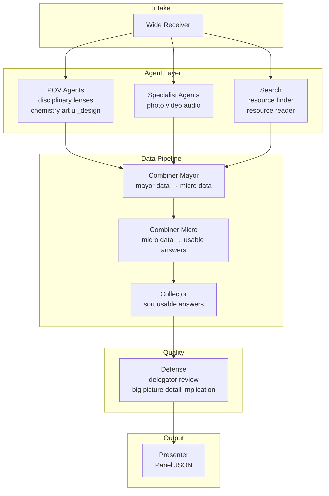

# TESS Engine — AI Architecture Map

## Core Concept

TESS is an event-driven, continuously processing AI engine. It does not rely on a traditional request-response model. Instead, it uses an open WebSocket connection, allowing the AI to stream data (Panels) asynchronously while the user can interrupt, steer, or modify the process on the fly.

## Tech Stack

| Layer | Technology |
|-------|------------|
| API & WebSockets | FastAPI (Python 3.11) |
| Background jobs | Celery + Redis |
| Orchestration | LangGraph |
| LLMs | Gemini (cloud) & Ollama (local) |
| Frontend | React + Vite |

## Data Flow (Transport)

```
User (Frontend)
  → WebSocket → FastAPI
  → Celery task dispatch
  → LangGraph (worker)
  → Redis Pub/Sub
  → WebSocket → Frontend renders Panels
```

---

## Target AI Chain (Full Vision)

The long-term orchestration model is a layered pipeline. Agents produce progressively refined data; combiners aggregate it; defense reviews it; the presenter packages the final output.



### Layer Responsibilities

| Layer | Role | Output |
|-------|------|--------|
| **Wide Receiver** | Reads the user message, interprets intent, alarms the required agents | Routing plan (`active_agents`, tasks, search triggers) |
| **POV Agents** | One per field of study / discipline (chemistry, art, ui_design, …); each answers from that lens | **Mayor data** — raw output tagged with `pov` |
| **Specialist Agents** | Media and tool specialists (photo, video, audio, coder) | **Mayor data** — processed artifacts |
| **Search** | Resource finder locates sources; resource reader extracts content | **Mayor data** — grounded excerpts and citations |
| **Combiner Mayor** | Gathers all mayor data from parallel agents + search | **Micro data** — sorted catalog with per-segment `source_agents` and `overlap_notes` |
| **Combiner Micro** | Dedupes catalog into user-facing segments | **Usable answers** — consensus prose, no repeated themes (`source_agents` per segment) |
| **Collector** | Collects usable answers and sorts them logically | Ordered answer set for presentation |
| **Defense** | QA layer: delegator, review, big-picture check, detail check, implication check | Pass / revise / reject per segment |
| **Presenter** | Formats collector output into typed Panel JSON for the frontend | `Panel` stream |

### Data Tiers

```
Mayor data  →  raw agent output (per topic / search / specialist)
Micro data  →  sorted catalog with overlap flags (Combiner Mayor)
Usable answers  →  deduplicated consensus segments (Combiner Micro)
Panel  →  user-facing payload (Presenter, after Defense)
```

### Complex Question Example

User asks a multi-perspective question (e.g. *"Design a school app UI — cover aesthetics and implementation"*).

1. **WR** alarms e.g. `art` + `ui_design` + optional `coder` POV agents (+ `photo` for diagram plan).
2. Each POV agent produces mayor data from its disciplinary lens.
3. **Combiner Mayor** catalogs and sorts perspectives; flags overlaps in `overlap_notes`.
4. **Combiner Micro** deduplicates into consensus segments → **Collector** → **Defense** → **Presenter**.

Legacy example (multi-subject factual): *"Compare renewable energy economics and chemistry"* → `economics` + `chemistry` POVs + optional search.

### Main Product Functions (Modes)

These are user-facing capabilities that WR routes into — not separate graphs, but intent profiles:

| Mode | Purpose |
|------|---------|
| **Research** | Deep factual exploration, citations, multi-source synthesis |
| **Planner** | Task breakdown, timelines, structured plans |
| **Coding platform** | Code generation, debugging, project scaffolding |
| **Builder** | Assembly of artifacts (docs, configs, multi-step outputs) |

Each mode influences WR routing (which topic/specialist agents to alarm) and which combiner depth is needed. **Phase 16 (live):** mode selector in frontend header; `product_mode` travels WebSocket → worker → `GraphState` → WR prompts and routing nudges; echoed on Panels.

---

## Current Implementation (Phase 19 — live)

The deployed graph uses **POV agents** — one disciplinary lens per agent (chemistry, art, ui_design, …). WR routes 1–3 relevant perspectives; combiners weave cross-POV answers; defense reviews before presentation. Completed Panels now offer **interactive follow-ups** and **clickable POV segment drill-down**.

### Frontend layout (Phase 18–19)

```
┌─────────────────────────────────────────────────────────────┐
│ Header: Mode + Depth + Connection                           │
│ Compare toggle (optional)                                   │
├─────────────────────────────────────────────────────────────┤
│ StatusWall: routing → Agents → Combine → Defense → Done     │
├──────────────┬──────────────────────────────────────────────┤
│ FolderTree   │ ResultsWall (PanelCards + pov_segments)      │
│              │  clickable segment titles + follow-up chips │
├──────────────┴──────────────────────────────────────────────┤
│ MessageInput                                                │
└─────────────────────────────────────────────────────────────┘
```

- **Status wall** — reads `pipeline_stage` from in-flight Panels; predicted steps from `agents_involved` (gate-aware by `output_level`).
- **Folder tree** — virtual navigation from agent `folder_path` registry (`app/core/folder_tree.py`); session-scoped filter only.
- **POV segments** — `pov_segments` on completed Panels; frontend renders titled blocks with POV badges. Segment titles are **clickable** — auto-send "Tell me more about {title}" via the same WebSocket path as follow-up chips. Builder ([`pov_segments.py`](app/graph/pov_segments.py)) uses `mayor_data` fallback when combiner thematic segments don't cover multiple routed POVs; single-lens runs (including `researcher` + search) omit segments and use flat `content`.
- **Interactive follow-ups (Phase 19)** — Presenter calls [`follow_up_utils.py`](app/graph/follow_up_utils.py) to generate 4 contextual chip labels (context-related, adjacent, choice themes) with `follow_up_kinds` for styling; falls back to `DEFAULT_FOLLOW_UP_OPTIONS` on LLM error.
- **Structured list format (Phase 19)** — [`list_format_utils.py`](app/graph/list_format_utils.py) detects top-N / ranked list intent and reformats bullet content as numbered lists; optional `content_format: ranked_list` on Panels.

```
START → wide_receiver → [parallel: POV agents | coder | researcher | general_assistant | photo | video | audio] + [optional: resource_finder → resource_reader]
      → post_fan_in → [bypass → defense | combiners → defense] → presenter → END
```

Combiner chain (when not bypassed):

```
post_fan_in → combiner_mayor → combiner_micro → collector → defense_delegator → defense_review → presenter
```

Defense chain (all paths):

```
defense_delegator → defense_review → [pass → presenter | revise → combiner_micro or specialist (bounded retries)]
```

| Node | Status | Notes |
|------|--------|-------|
| Wide Receiver | ✅ Live | Routes to 1–3 specialists; POV keyword override; **product mode** rules and routing nudges (Phase 16) |
| POV Agents | ✅ Live | Chemistry, Biology, Economics, Art, UI Design — one lens per discipline; `researcher` fallback for off-matrix topics |
| Specialist Agents (media) | ✅ Live | Photo, Video, Audio — diagram plans, scripts, outlines (text-first; URL when provided) |
| Search | ✅ Live | Resource finder (DuckDuckGo / Tavily) → resource reader; feeds `mayor_data` with citations |
| Combiner Mayor | ✅ Live | Curates `mayor_data` → sorted `micro_data` with `overlap_notes` |
| Combiner Micro | ✅ Live | Dedupes `micro_data` → `usable_answers` with consensus language |
| Collector | ✅ Live | Deterministic sort by `order_hint` |
| Defense Delegator | ✅ Live | Normalizes segments for review (wraps bypass `mayor_data` when needed) |
| Defense Review | ✅ Live | Single LLM call returns all three checks per segment; length cap guidance; emits `review_passed` Panel |
| Presenter | ✅ Live | Reads approved `usable_answers`; async LLM follow-up generation; list format post-processing; emits `completed` Panel with `pov_sources`, `pov_segments`, `follow_up_options`, `follow_up_kinds`, `pipeline_stage=done` |

**Bypass rule:** Skip combiners when `len(active_agents) <= 1` and no `resource_reader` entry — single-agent prompts stay fast. Defense always runs (lightweight single-check review on all paths).

**Defense retry:** On `revise`, loops back to `combiner_micro` (synthesis path) or originating specialist (bypass path); capped at `MAX_DEFENSE_RETRIES=2`. Fan-in join waits for all parallel branches; refusal auto-revise; WR routes listed POV topics to POV agents, off-matrix factual topics to researcher.

**Fan-in join (13.1):** `post_fan_in` waits until all expected branches (`active_agents` + optional `resource_reader`) report done before routing downstream.

### Live POV Agents (Phase 15B)

| Agent | `folder_path` | Lens | Routes when |
|-------|---------------|------|-------------|
| `chemistry` | `Science/Chemistry` | Chemistry | Bonding, reactions, materials, stoichiometry |
| `biology` | `Science/Biology` | Biology | Cells, ecosystems, physiology, genetics |
| `economics` | `Social Studies/Economics` | Economics | Supply, demand, markets, trade-offs |
| `art` | `Arts/Visual` | Art | Composition, color, aesthetics, visual hierarchy |
| `ui_design` | `Design/UI` | UI Design | Layout, usability, patterns, accessibility |

### Live Tool & Media Agents

| Agent | `folder_path` | Routes when |
|-------|---------------|-------------|
| `coder` | `Coding/Projects` | Code generation, debugging, refactoring |
| `researcher` | `Research/Topics` | Factual research for off-matrix topics (Kubernetes, history, etc.) |
| `general_assistant` | `Assistant/General` | Casual chat and general tasks |
| `photo` | `Media/Photo` | Diagram plans, image descriptions, visual layouts |
| `video` | `Media/Video` | Video scripts, storyboards, edit plans |
| `audio` | `Media/Audio` | Voiceover scripts, podcast outlines, audio plans |

Config pattern: `app/agents/<name>/config.py` + `prompt.py`, registered in `app/agents/registry.py`.

### Agent Visibility (Phase 9–11)

- **`AgentTrace`** — per-node record (`agent_name`, `inputs_seen`, `task_summary`, `output_preview`)
- **`agents_involved`** — human-readable pipeline on each Panel (all parallel agents + search when active)
- **`MayorData`** — per-specialist raw output in graph state before combiner stages; POV agents set `pov`; `resource_reader` populates `citations`
- **`pov_sources`** — disciplinary lenses on WR, combiner, defense, and completed Panels (Phase 15B)
- **`product_mode`** — intent profile echoed on processing and completed Panels when not `auto` (Phase 16)
- **`MicroData`** / **`UsableAnswer`** — combiner pipeline types; Presenter reads ordered `usable_answers` on synthesis path
- **`output_level`** — chain profile echoed on Panels for compare UI (Phase 17)
- **`pipeline_stage`** — machine-readable chain phase on every streamed Panel (Phase 18)
- **`pov_segments`** — structured per-lens sections on completed Panels (Phase 18)
- **`follow_up_options`** / **`follow_up_kinds`** — LLM-generated contextual chips on completed Panels (Phase 19)
- **`content_format`** — `ranked_list` when list intent detected (Phase 19)
- **`is_streaming`** — when `true`, `content` is a token delta appended client-side on the same `panel_id` (Phase 20)
- **Mid-chain steer** — send while processing revokes in-flight Celery task via `app/core/session_control.py` (Phase 20)
- **Processing Panel** — WR streams `status: processing` with `pipeline_stage=routing`; specialists publish streaming `agents` stage content; combiners/defense set `combining`/`defense`
- Worker uses `astream(stream_mode="updates")` for incremental Redis publish; Celery soft limit **720s** (~12 min) for multi-POV pipelines
- Parallel fan-out via LangGraph `Send` API; fan-in at Presenter (max 3 agents + optional search)
- Search provider: DuckDuckGo default; Tavily when `TAVILY_API_KEY` is set

---

## Output Levels (Live — Phase 17)

User-selectable **chain profiles** gate graph depth on a single LangGraph. Orthogonal to product modes (intent).

| Level | Name | Chain | Use case |
|-------|------|-------|----------|
| **L0** | Direct | Single LLM → Presenter (no WR) | Baseline speed and quality |
| **L1** | Routed | WR → one specialist → Presenter | Single-domain fast path |
| **L1+** | Parallel | WR → 1–3 specialists → Presenter (no combiners/defense) | Multi-POV raw output |
| **L2** | Reviewed | L1 + Defense | QA-checked single-agent answer |
| **L3** | Grounded | L2 + Search | Citations and source grounding |
| **L4** | Full chain | WR → agents → Combiners (multi) → Defense → Presenter | Production default |

Gate logic lives in `app/graph/chain_gates.py`. L0 entry via `direct_responder` node. Frontend chain selector + compare UI stack Panels by `output_level`.

---

## Key Files

| Area | Path |
|------|------|
| Graph definition | `app/graph/builder.py` |
| Combiner nodes | `app/graph/nodes/combiner_mayor.py`, `combiner_micro.py`, `collector.py`, `post_fan_in.py` |
| Defense nodes | `app/graph/nodes/defense_delegator.py`, `defense_review.py` |
| Defense utilities | `app/graph/defense_utils.py` |
| Fan-in utilities | `app/graph/fan_in_utils.py` |
| Combiner utilities | `app/graph/combiner_utils.py` |
| WR routing | `app/graph/nodes/wide_receiver.py`, `app/graph/routing.py` |
| Chain profiles | `app/core/chain_profiles.py`, `app/graph/chain_gates.py`, `app/graph/nodes/direct_responder.py` |
| Search nodes | `app/graph/nodes/resource_finder.py`, `app/graph/nodes/resource_reader.py` |
| Search utilities | `app/search/provider.py`, `app/search/fetcher.py`, `app/search/extractor.py` |
| Specialist nodes | `app/graph/nodes/<name>.py` |
| Agent registry | `app/agents/registry.py`, `app/agents/subjects/registry.py` |
| Phase 15B brief | `PHASE_15B_OPENER.md` |
| Shared specialist runner | `app/agents/base.py` |
| Presenter | `app/graph/nodes/presenter.py` |
| Panel schema | `app/graph/schemas.py`, `SCHEMA.md` |
| Pipeline stages | `app/graph/pipeline_stages.py` |
| POV segments builder | `app/graph/pov_segments.py` |
| Follow-up generator | `app/graph/follow_up_utils.py` |
| Token streaming | `app/graph/stream_utils.py` |
| Session steer | `app/core/session_control.py` |
| List format utils | `app/graph/list_format_utils.py` |
| Folder tree (backend) | `app/core/folder_tree.py` |
| Worker | `app/worker.py` |
| Frontend status wall | `frontend/src/components/StatusWall.tsx`, `usePipelineStatus.ts` |
| Frontend folder / results | `frontend/src/components/FolderTree.tsx`, `ResultsWall.tsx`, `PanelSegments.tsx` |
| Frontend drill-down | `frontend/src/utils/drillDown.ts` |
| Frontend Panel UI | `frontend/src/components/PanelCard.tsx` |
