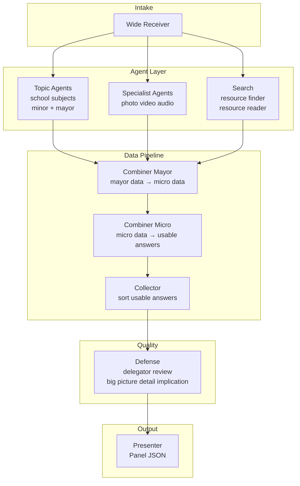

# TESS Engine — AI Architecture Map

## Core Concept

TESS is an event-driven, continuously processing AI engine. It does not rely on a traditional request-response model. Instead, it uses an open WebSocket connection, allowing the AI to stream data (Panels) asynchronously while the user can interrupt, steer, or modify the process on the fly.

## Tech Stack

| Layer | Technology |
|-------|------------|
| API & WebSockets | FastAPI (Python 3.11) |
| Background jobs | Celery + Redis |
| Orchestration | LangGraph |
| LLMs | Gemini (cloud) & Ollama (local) |
| Frontend | React + Vite |

## Data Flow (Transport)

```
User (Frontend)
  → WebSocket → FastAPI
  → Celery task dispatch
  → LangGraph (worker)
  → Redis Pub/Sub
  → WebSocket → Frontend renders Panels
```

---

## Target AI Chain (Full Vision)

The long-term orchestration model is a layered pipeline. Agents produce progressively refined data; combiners aggregate it; defense reviews it; the presenter packages the final output.



### Layer Responsibilities

| Layer | Role | Output |
|-------|------|--------|
| **Wide Receiver** | Reads the user message, interprets intent, alarms the required agents | Routing plan (`active_agents`, tasks, search triggers) |
| **Topic Agents** | One per school subject (and minor/major depth variants); domain reasoning | **Mayor data** — raw specialist output per topic |
| **Specialist Agents** | Media and tool specialists (photo, video, audio) | **Mayor data** — processed media artifacts |
| **Search** | Resource finder locates sources; resource reader extracts content | **Mayor data** — grounded excerpts and citations |
| **Combiner Mayor** | Gathers all mayor data from parallel agents + search | **Micro data** — structured, cross-topic synthesis |
| **Combiner Micro** | Refines micro data into coherent answer units | **Usable answers** — ranked, actionable segments |
| **Collector** | Collects usable answers and sorts them logically | Ordered answer set for presentation |
| **Defense** | QA layer: delegator, review, big-picture check, detail check, implication check | Pass / revise / reject per segment |
| **Presenter** | Formats collector output into typed Panel JSON for the frontend | `Panel` stream |

### Data Tiers

```
Mayor data  →  raw agent output (per topic / search / specialist)
Micro data  →  cross-agent synthesis (Combiner Mayor)
Usable answers  →  refined segments ready for review (Combiner Micro)
Panel  →  user-facing payload (Presenter, after Defense)
```

### Complex Question Example

User asks a multi-domain question (e.g. *"Compare renewable energy economics and chemistry for a school project, include a diagram plan, and cite recent sources"*).

1. **WR** alarms e.g. 4 topic agents (Economics, Chemistry, …) + 1 specialist (photo/diagram) + search.
2. **Search** runs resource finder → resource reader; results feed **Combiner Mayor** alongside topic agent mayor data.
3. **Combiner Mayor** produces micro data cross-linking topics and sources.
4. **Combiner Micro** turns micro data into usable answer segments.
5. **Collector** sorts segments (intro → comparison → diagram plan → citations).
6. **Defense** reviews each segment (accuracy, completeness, implications).
7. **Presenter** streams one or more Panels with `agents_involved` and `agent_traces`.

### Main Product Functions (Modes)

These are user-facing capabilities that WR routes into — not separate graphs, but intent profiles:

| Mode | Purpose |
|------|---------|
| **Research** | Deep factual exploration, citations, multi-source synthesis |
| **Planner** | Task breakdown, timelines, structured plans |
| **Coding platform** | Code generation, debugging, project scaffolding |
| **Builder** | Assembly of artifacts (docs, configs, multi-step outputs) |

Each mode influences WR routing (which topic/specialist agents to alarm) and which combiner depth is needed.

---

## Current Implementation (Phase 11)

What is **built and deployed today** is a parallel multi-specialist chain with an optional search sub-pipeline. WR can alarm 1–3 specialists and optionally trigger web search; they run concurrently via LangGraph `Send` fan-out and merge at Presenter.

```
START → wide_receiver → [parallel: coder | researcher | general_assistant] + [optional: resource_finder → resource_reader] → presenter → END
```

| Node | Status | Notes |
|------|--------|-------|
| Wide Receiver | ✅ Live | Routes to 1–3 specialists; emits `search_queries` (0–1) when sources needed |
| Topic Agents (subjects) | 🟡 Partial | Coder / Researcher run in parallel as early stand-ins, not full subject matrix |
| Specialist Agents (media) | ⬜ Planned | |
| Search | ✅ Live | Resource finder (DuckDuckGo / Tavily) → resource reader; feeds `mayor_data` with citations |
| Combiner Mayor / Micro | ⬜ Planned | Presenter merges `mayor_data` directly for now |
| Collector | ⬜ Planned | |
| Defense | ⬜ Planned | |
| Presenter | ✅ Live | Merges multi-agent `mayor_data` + `## Sources` section when search ran |

### Live Specialist Agents

| Agent | `folder_path` | Routes when |
|-------|---------------|-------------|
| `coder` | `Coding/Projects` | Code generation, debugging, refactoring |
| `researcher` | `Research/Topics` | Factual research, explanations, summaries |
| `general_assistant` | `Assistant/General` | Casual chat and general tasks |

Config pattern: `app/agents/<name>/config.py` + `prompt.py`, registered in `app/agents/registry.py`.

### Agent Visibility (Phase 9–11)

- **`AgentTrace`** — per-node record (`agent_name`, `inputs_seen`, `task_summary`, `output_preview`)
- **`agents_involved`** — human-readable pipeline on each Panel (all parallel agents + search when active)
- **`MayorData`** — per-specialist raw output in graph state before combiner stages; `resource_reader` populates `citations`
- **Processing Panel** — WR streams `status: processing` immediately with all alarmed agent badges; Presenter updates same `panel_id` to `completed`
- Worker uses `astream(stream_mode="updates")` for incremental Redis publish
- Parallel fan-out via LangGraph `Send` API; fan-in at Presenter (max 3 agents + optional search)
- Search provider: DuckDuckGo default; Tavily when `TAVILY_API_KEY` is set

---

## Research: Output Levels (Proposed)

A high-value research feature: let the user **select an output level** and compare results from different chain depths on the same question.

| Level | Name | Chain | Use case |
|-------|------|-------|----------|
| **L0** | Direct | Single Ollama/Gemini call, no graph | Baseline speed and quality |
| **L1** | Routed | WR → one specialist → Presenter | Single-domain default |
| **L1+** | Parallel routed | WR → parallel specialists → Presenter | **Current Phase 10** (1–3 agents) |
| **L2** | Reviewed | L1 + Defense pass before Panel | QA comparison |
| **L3** | Grounded | L2 + Search (finder + reader) | Citation and source quality |
| **L4** | Multi-agent | WR → parallel topic agents → Mayor → Micro → Collector → Defense → Presenter | Full TESS chain |

### Why this is a strong direction

1. **Measurable quality ladder** — Same prompt, different levels; `agent_traces` already show what each agent saw, so diffs are inspectable.
2. **Cost / latency tradeoffs** — L0 is fast; L4 is thorough. Users (and researchers) pick consciously.
3. **Incremental delivery** — Each level reuses the previous graph as a subgraph; ROADMAP can add levels without rewriting.
4. **UI fit** — A level selector in the frontend maps to a `chain_profile` field on the request; Panels can include `output_level` in metadata for side-by-side comparison views.

### Suggested implementation path

1. Add `chain_profile: Literal["L0", "L1", …]` to session or per-message request (see `SCHEMA.md`).
2. Build L0 as a bypass graph (no WR) for baseline.
3. Keep L1 as default (current graph).
4. Add L2–L4 as new LangGraph branches/subgraphs as combiners and defense land.

---

## Key Files

| Area | Path |
|------|------|
| Graph definition | `app/graph/builder.py` |
| WR routing | `app/graph/nodes/wide_receiver.py`, `app/graph/routing.py` |
| Search nodes | `app/graph/nodes/resource_finder.py`, `app/graph/nodes/resource_reader.py` |
| Search utilities | `app/search/provider.py`, `app/search/fetcher.py`, `app/search/extractor.py` |
| Specialist nodes | `app/graph/nodes/<name>.py` |
| Agent registry | `app/agents/registry.py` |
| Shared specialist runner | `app/agents/base.py` |
| Presenter | `app/graph/nodes/presenter.py` |
| Panel schema | `app/graph/schemas.py`, `SCHEMA.md` |
| Worker | `app/worker.py` |
| Frontend Panel UI | `frontend/src/components/PanelCard.tsx` |
