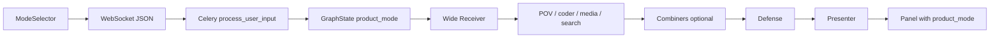

# TESS Engine — Phase 16 Session Opening Message

## Context

Phases 1–15C are complete. The live graph runs **POV agents** (disciplinary lenses), **curator/editor combiners** (Mayor sorts + flags overlap; Micro dedupes into consensus), **defense**, and **presenter**. Multi-POV pipelines complete within a **12-minute** Celery budget on CPX11 with `llama3.2:1b`.

Architecture docs: [AI_MAP.md](AI_MAP.md), [ROADMAP.md](ROADMAP.md), [SCHEMA.md](SCHEMA.md).

**Phase 16 goal:** Add **product modes** — user-facing intent profiles that steer Wide Receiver routing and default chain depth **without** building four separate LangGraphs.

| Phase 15C baseline (reuse) | Phase 16 adds |
|----------------------------|---------------|
| POV matrix + keyword override | Mode-aware WR routing rules |
| Mayor catalog + `overlap_notes` | Mode-specific combiner/defense hints |
| Micro consensus dedupe | Mode-specific output shape expectations |
| `pov_sources` on Panels | `product_mode` on state + Panels |
| Plain-text WebSocket messages | JSON envelope with optional `product_mode` |

**Important:** Product modes are **intent profiles**, not separate graphs. One graph; WR and downstream prompts adapt per mode. Explicit **L0–L4 chain profile UI** is **Phase 17** — Phase 16 only sets **implicit defaults** per mode (e.g. Research → grounded + reviewed).

### Phase 15C baseline (shipped)

| Area | Status |
|------|--------|
| Mayor role | Curator — sort, catalog, `overlap_notes`, per-segment `source_agents` |
| Micro role | Editor — dedupe, consensus prose ("Multiple sources confirm…") |
| Schema | `MicroDataSegment.overlap_notes`, `source_agents` on segments + `UsableAnswer` |
| Code | [`app/graph/prompts.py`](app/graph/prompts.py), [`app/graph/schemas.py`](app/graph/schemas.py), [`app/graph/combiner_utils.py`](app/graph/combiner_utils.py) |
| Tests | 7 new tests in [`tests/test_combiner_utils.py`](tests/test_combiner_utils.py); **20 total** in Docker |
| Canonical multi-POV prompt | *"Design a science app UI covering aesthetics and usability"* → `art` + `ui_design` → combiners → defense |

**Known limits (15C):**

- Small model (`llama3.2:1b`) may still duplicate themes in Micro output — structure and fallbacks ensure valid JSON flows through.
- No `product_mode` yet — plain-text WebSocket only; worker accepts user text string, not JSON envelope.

---

## Production

| Item | Value |
|------|-------|
| URL | http://5.78.186.223 (HTTP/IP mode) |
| Repo | https://github.com/sykis17/tess.git |
| Server path | `/opt/tess-engine` — deploy with `git pull && ./deploy/deploy.sh` |
| Local | Docker Compose + Ollama on Windows host; frontend `npm run dev` |
| Tests | `pytest tests/test_pov_routing.py tests/test_combiner_utils.py` |

---

## Goal for Phase 16: Product modes

Let the user pick **how** TESS should approach a question before sending it. The mode travels from frontend → WebSocket → Celery worker → `GraphState` → Wide Receiver (and optionally combiner/defense prompts).

### Four modes (first deploy)

| Mode key | User label | Purpose | Implicit chain bias (until Phase 17 UI) |
|----------|------------|---------|------------------------------------------|
| `research` | Research | Deep factual exploration, citations, multi-source synthesis | **L3+** — favor `search_queries` when grounding helps; always defense; combiners when multi-agent |
| `planner` | Planner | Task breakdown, timelines, milestones, structured plans | **L2+** — WR favors planning-friendly agents; combiners for multi-step plans; defense checks structure |
| `coding` | Coding | Project-scoped code generation, debugging, refactoring | **L1–L2** — WR routes to `coder`; combiners only when coder + researcher/POV; defense checks runnable code |
| `builder` | Builder | Multi-artifact assembly (docs + config + code + media plans) | **L4** — WR may alarm `coder` + media + POV; combiners almost always; defense checks completeness |

### Default / backward compatibility

| Value | Behavior |
|-------|----------|
| `auto` (recommended default) | Current Phase 15C behavior — WR decides freely; plain-text WS messages map here |
| Explicit mode | WR receives `product_mode` in state and applies mode routing rules below |

Do **not** break existing clients: plain `receive_text()` messages must keep working as `auto`.

---

## Mode semantics (design detail)

### Research

- **When to use:** "Explain X with sources", comparisons, literature-style answers, explore topics deeply.
- **WR bias:**
  - Prefer POV agents for on-matrix disciplines; `researcher` for off-matrix factual topics.
  - Set `search_queries` when user asks for citations, sources, latest data, or grounded claims.
  - Alarm 2–3 POVs when question spans lenses (same as today).
- **Combiner bias:** Mayor catalogs per-source inventory; Micro writes synthesis with explicit source agreement.
- **Defense bias:** Stricter on unsupported claims; flag missing citations when user asked for sources.
- **Example:** *"Compare renewable energy economics and chemistry with recent sources"* → `economics` + `chemistry` + search → combiners → defense.

### Planner

- **When to use:** "Plan my week", "Roadmap for X", "Steps to launch Y", timelines, checklists.
- **WR bias:**
  - Route to agents that match domain (POV or `researcher`) **plus** structure the output as a plan.
  - `current_task` should say "structured plan" or "timeline" explicitly.
  - Search optional — only when plan needs external facts (market data, regulations).
  - Usually 1–2 agents; avoid over-alarming unless domain is clearly multi-POV.
- **Combiner bias:** Micro output uses numbered phases, milestones, dates/durations where inferable.
- **Defense bias:** Check for actionable steps, ordering, missing dependencies.
- **Example:** *"Plan a 4-week study schedule for AP Chemistry"* → `chemistry` → bypass or light combiner → defense.

### Coding

- **When to use:** "Write a Python function", "Debug this error", "Refactor module", "Scaffold FastAPI app".
- **WR bias:**
  - Primary agent: `coder`.
  - Add `researcher` only when user needs external API/docs lookup.
  - Rarely alarm POV agents unless code explicitly serves a domain (e.g. chemistry simulation).
- **Combiner bias:** Usually bypassed (single agent); if multi-agent, Micro merges code + explanation without duplicating snippets.
- **Defense bias:** Check code completeness, obvious syntax issues, alignment with stated language/framework.
- **Project scope (Phase 16 minimal):** Use `session_id` as implicit project key; store last N coding turns in conversation history (already live). Full project filesystem is **out of scope**.
- **Example:** *"Write a Python sort function"* → `coder` only → bypass → defense.

### Builder

- **When to use:** "Build a landing page package", "Create docs + config + script", multi-deliverable requests.
- **WR bias:**
  - Alarm 2–3 agents across **artifact types**: `coder`, media (`photo`/`video`/`audio`), relevant POV.
  - `current_task` should list expected artifacts.
  - Search when external references needed.
- **Combiner bias:** Mayor groups by artifact type; Micro produces one section per deliverable (README, config, code, diagram plan).
- **Defense bias:** Check all requested artifact types are present; flag gaps.
- **Example:** *"Build a science app README, wireframe plan, and starter HTML/CSS"* → `ui_design` + `photo` + `coder` → combiners → defense.

---

## Target data flow



### Request envelope (new — backward compatible)

**Plain text (legacy):** user message string → `product_mode = "auto"`.

**JSON (Phase 16):**

```json
{
  "text": "Design a science app UI covering aesthetics and usability",
  "product_mode": "research"
}
```

Optional fields for future phases (ignore in 16 unless trivial): `chain_profile`, `project_id`.

### GraphState extension

```python
product_mode: str  # "auto" | "research" | "planner" | "coding" | "builder"
```

Set in `build_initial_state()` from worker; default `"auto"`.

### Panel extension

```python
product_mode: str | None = None  # echo active mode on processing + completed Panels
```

Frontend shows active mode badge near POV badges (subtle chip).

---

## Code touchpoints (before Phase 16)

Exact files to change — no grepping required.

### WebSocket — plain text only today

```56:59:app/api/ws.py
            user_message = await websocket.receive_text()

            try:
                process_user_input.delay(user_message, session_id)
```

**After Phase 16:** WS forwards the raw payload string unchanged; parsing happens in the worker so Celery dispatch stays one argument.

### Worker — no mode parameter

```154:162:app/worker.py
def process_user_input(user_input: str, session_id: str) -> None:
    """Run the LangGraph chain and stream resulting Panels via Redis Pub/Sub."""
    channel = session_channel(session_id)
    redis_client = create_sync_redis()

    try:
        history = load_conversation_history(session_id)
        panel_id = str(uuid.uuid4())
        initial_state = build_initial_state(user_input, history, panel_id=panel_id, session_id=session_id)
```

**After Phase 16:** Rename first arg to `payload`; call `parse_incoming_payload(payload)` → `(user_text, product_mode)`; pass mode into `build_initial_state()`.

### GraphState — no `product_mode` yet

[`app/graph/state.py`](app/graph/state.py) — `GraphState` has 20 fields; `build_initial_state()` does not accept or set `product_mode`.

**After Phase 16:**

```python
product_mode: str  # add to GraphState; default "auto" in build_initial_state()
```

### Frontend — plain text send

```111:117:frontend/src/hooks/useWebSocket.ts
  const sendMessage = useCallback((text: string) => {
    const ws = wsRef.current;
    if (ws?.readyState === WebSocket.OPEN) {
      setIsProcessing(true);
      setLastError(null);
      ws.send(text);
```

**After Phase 16:** `sendMessage(text, productMode?)` — send plain text when mode is `auto`, else `JSON.stringify({ text, product_mode })`.

---

## What's working (Phase 15C baseline to reuse)

| Concept | Behavior |
|---------|----------|
| POV registry | `app/agents/subjects/registry.py` — five lenses |
| WR routing | `parse_routing_decision` + keyword POV/media overrides |
| Combiner Mayor | Curator — `overlap_notes`, per-segment `source_agents` |
| Combiner Micro | Editor — dedupe, consensus language |
| Combiner bypass | `len(active_agents) <= 1` and no `resource_reader` |
| Defense | Three checks; `review_passed` before `completed` |
| Fan-in / timeout | 720s pipeline; pre-LLM progress panels |
| Conversation history | Redis per `session_id` for follow-ups |

---

## Deliverables

| Area | Work |
|------|------|
| **Mode registry** | `app/core/product_modes.py` — `ProductMode` enum/literal, display names, WR rule snippets per mode |
| **GraphState** | Add `product_mode` to `GraphState` + `build_initial_state()` |
| **Worker** | Parse WS payload: plain text **or** JSON; pass `product_mode` into initial state |
| **WebSocket API** | `app/api/ws.py` — accept JSON envelope; validate mode; fallback to `auto` |
| **WR prompt** | Inject mode block into `WIDE_RECEIVER_SYSTEM_PROMPT` (or dynamic section from registry) |
| **Mode routing helpers** | Post-parse adjustments in `routing.py` (e.g. research → nudge `search_queries`; coding → ensure `coder` primary) |
| **Combiner prompts** | Optional mode-aware appendix (planner → phased output; builder → per-artifact sections) |
| **Defense prompt** | Optional mode-aware checks (research → citations; coding → code sanity) |
| **Presenter / Panels** | Set `product_mode` on processing and completed Panels |
| **Frontend mode selector** | Toggle or dropdown in header; persist in React state per session |
| **Frontend send** | `useWebSocket.sendMessage` sends JSON when mode ≠ `auto` (or always JSON with mode field) |
| **Types** | `frontend/src/types/panel.ts` — `product_mode?: string` |
| **Tests** | `tests/test_product_modes.py` — routing nudges per mode, JSON parse, backward compat |
| **Docs** | Update `AI_MAP.md`, `SCHEMA.md`, `ROADMAP.md`; mark Phase 16 complete |
| **Deploy** | Commit + production deploy |

### Implementation order

1. [`app/core/product_modes.py`](app/core/product_modes.py) — registry + validation + WR rule snippets
2. [`app/core/ws_payload.py`](app/core/ws_payload.py) — `parse_incoming_payload()` (or inline in worker)
3. [`app/graph/state.py`](app/graph/state.py) — `product_mode` on `GraphState` + `build_initial_state()`
4. [`app/graph/schemas.py`](app/graph/schemas.py) — `product_mode` on `Panel`
5. [`app/worker.py`](app/worker.py) — parse payload; pass mode into initial state; echo on Panels
6. [`app/api/ws.py`](app/api/ws.py) — forward raw payload (no parse in WS layer)
7. [`app/graph/prompts.py`](app/graph/prompts.py) — inject mode block into WR; optional combiner/defense appendices
8. [`app/graph/routing.py`](app/graph/routing.py) — `apply_product_mode_routing()` after POV override (do not regress 15B)
9. [`app/graph/nodes/wide_receiver.py`](app/graph/nodes/wide_receiver.py) — read `product_mode` from state; echo on processing Panel
10. [`frontend/src/components/ModeSelector.tsx`](frontend/src/components/ModeSelector.tsx) + [`App.tsx`](frontend/src/App.tsx) — header selector
11. [`frontend/src/hooks/useWebSocket.ts`](frontend/src/hooks/useWebSocket.ts) — JSON envelope when mode ≠ `auto`
12. [`frontend/src/types/panel.ts`](frontend/src/types/panel.ts) — `product_mode?: string`
13. [`tests/test_product_modes.py`](tests/test_product_modes.py) — routing nudges, parse, backward compat

---

## Implementation notes

### Transport: `parse_incoming_payload`

Single shared parser used by the worker (WS stays thin — forwards raw string):

```python
# app/core/ws_payload.py (recommended) or inline in worker
def parse_incoming_payload(raw: str) -> tuple[str, str]:
    """Return (user_text, product_mode). Plain text → (raw, 'auto')."""
```

**Rules:**

1. Try `json.loads(raw)`; require `text` key (non-empty string).
2. Read optional `product_mode`; validate against registry via `product_modes.py`; invalid or missing → `"auto"`.
3. Non-JSON or parse failure → treat entire string as user text, mode `"auto"`.
4. Worker signature stays `process_user_input(payload: str, session_id: str)` — parse inside worker so Celery dispatch stays one arg.

### Mode registry sketch

[`app/core/product_modes.py`](app/core/product_modes.py):

```python
from enum import Enum

class ProductMode(str, Enum):
    AUTO = "auto"
    RESEARCH = "research"
    PLANNER = "planner"
    CODING = "coding"      # key is "coding", display label "Coding"
    BUILDER = "builder"

# ProductModeConfig: display_name, wr_rules: str, combiner_hint: str | None
MODES: dict[str, ProductModeConfig]

def validate_product_mode(mode: str | None) -> str: ...
def get_wr_rules_block(mode: str) -> str: ...
```

**Naming:** Mode key is `coding` (per [SCHEMA.md](SCHEMA.md)); display label in UI may read "Coding" or "Coding platform" (per [AI_MAP.md](AI_MAP.md) Main Product Functions).

### WR prompt pattern

Add a section generated from the mode registry, e.g.:

```
Active product mode: research
- Favor search_queries when the user needs citations or grounded facts.
- Prefer multi-POV routing when the question spans disciplines.
- Do not route casual chat to researcher.
```

Keep mode rules **short** — small models lose JSON discipline if the system prompt grows too large.

### Mode routing helpers (after WR JSON parse)

Apply **lightweight** post-processing in `parse_routing_decision` or a new `apply_product_mode_routing(mode, decision, user_input)` — similar to POV keyword override:

| Mode | Helper behavior |
|------|-----------------|
| `research` | If user mentions cite/sources/latest and `search_queries` empty → infer one query |
| `planner` | Append "structured plan" to `current_task` if missing plan language |
| `coding` | If no `coder` in agents and input looks like code → replace/prioritize `coder` |
| `builder` | If single agent but input lists multiple deliverables → expand toward 2–3 agents |

Do **not** override POV keyword correction from Phase 15B.

### Implicit chain profile (Phase 16 only)

Document defaults in code comments and `product_modes.py`; **do not** build L0 bypass graph yet (Phase 17). For Phase 16:

| Mode | Minimum path |
|------|----------------|
| `research` | Always run defense; encourage search when appropriate |
| `planner` | Always run defense |
| `coding` | Defense on all paths; combiner bypass OK for single `coder` |
| `builder` | Prefer multi-agent + combiners when WR alarms 2+ agents |

### Frontend UX (minimal)

- Mode selector in `app-header` (4 buttons or `<select>`).
- Default: **Auto** (current behavior).
- Show active mode on completed Panel card (small label).
- No mode persistence across browser tabs required in v1; `localStorage` optional nice-to-have.

---

## Test matrix (Phase 16)

Assume explicit mode unless testing `auto`.

| Mode | Input | Expected routing | Notes |
|------|-------|------------------|-------|
| `auto` | Plain text "Hey, how are you?" | `general_assistant` | Legacy WS compat |
| `research` | "Explain photosynthesis with citations" | `biology` + `search_queries` | Search nudged |
| `research` | "Compare economics and chemistry" | `economics` + `chemistry` → combiners | Multi-POV |
| `planner` | "Plan a 2-week UI design sprint" | `ui_design` (maybe `art`) | `current_task` mentions plan |
| `coding` | "Write a Python sort function" | `coder` only | Bypass combiners |
| `coding` | "Debug my FastAPI route" | `coder` | No spurious POV |
| `builder` | "README + wireframe + HTML for science app" | 2–3 agents incl. media/coder | Combiners likely |
| `builder` | JSON envelope with `product_mode: "builder"` | Same as above | WS JSON parse |

Verify: `product_mode` on WR processing Panel and completed Panel; mode selector reflected in outbound JSON; plain-text clients unchanged.

---

## Out of scope for Phase 16 (future phases)

| Phase | Feature |
|-------|---------|
| **17** | User-selectable **L0–L4** chain profiles; `output_level` on Panels; L0 bypass graph; side-by-side compare UI |
| **18** | Pipeline status wall + results wall from folder tree |
| **19** | Drill-down titles, context-related/deviating questions, top-10 lists, 4 choice themes |
| **20** | Token streaming |
| Post-16 | Real project workspaces (files, repos), mode-specific subgraphs, per-mode Celery queues |

---

## Constraints

- Follow `.cursorrules` (async, Pydantic, Celery for heavy work, modular structure).
- CPX11 / `llama3.2:1b` — keep WR prompt additions compact; test JSON routing still parses.
- English for user-facing text and comments.
- Backward-compatible Panels and WebSocket — new fields optional; plain text messages must work.
- Visibility first: mode appears in `agents_involved` trace context or Panel metadata.
- Never return `{}` from nodes.
- Reuse Phase 15B/15C routing tests — do not regress POV override or combiner curator/editor behavior.

---

## Key files (Phase 15C baseline)

| Area | Path |
|------|------|
| Graph | `app/graph/builder.py` |
| WR routing | `app/graph/nodes/wide_receiver.py`, `app/graph/routing.py`, `app/graph/prompts.py` |
| POV registry | `app/agents/subjects/registry.py` |
| Combiners | `app/graph/combiner_utils.py`, `app/graph/nodes/combiner_mayor.py`, `combiner_micro.py` |
| Defense | `app/graph/nodes/defense_review.py`, `app/graph/defense_utils.py` |
| State | `app/graph/state.py`, `app/graph/schemas.py` |
| Worker / WS | `app/worker.py`, `app/api/ws.py` |
| Frontend | `frontend/src/App.tsx`, `hooks/useWebSocket.ts`, `types/panel.ts`, `components/PanelCard.tsx` |

**New files (expected):**

| Area | Path |
|------|------|
| Mode registry | `app/core/product_modes.py` |
| Mode tests | `tests/test_product_modes.py` |
| Mode selector UI | `frontend/src/components/ModeSelector.tsx` (or inline in App) |

---

## Try it / Verify locally

**Baseline (must stay green before and after Phase 16):**

```bash
pytest tests/test_pov_routing.py tests/test_combiner_utils.py
```

**After Phase 16:**

```bash
pytest tests/test_product_modes.py
docker compose restart worker   # pick up new WR prompts
```

| Mode | Send | Expect |
|------|------|--------|
| `auto` | Plain text: "Hey, how are you?" | `general_assistant`; no `product_mode` on Panel (or `"auto"`) |
| `research` | JSON: `{"text": "Explain photosynthesis with citations", "product_mode": "research"}` | `biology` + `search_queries`; `product_mode` on Panel |
| `planner` | JSON: `{"text": "Plan a 2-week UI design sprint", "product_mode": "planner"}` | `ui_design`; plan-shaped `current_task` |
| `coding` | JSON: `{"text": "Write a Python sort function", "product_mode": "coding"}` | `coder` only; combiner bypass |
| `builder` | JSON: `{"text": "README + wireframe + HTML for science app", "product_mode": "builder"}` | 2–3 agents; combiners likely |

**UI checks:**

- Mode selector visible in `app-header` beside session ID ([`App.tsx`](frontend/src/App.tsx)).
- Completed Panel shows mode chip in [`PanelCard.tsx`](frontend/src/components/PanelCard.tsx) (near POV badges).
- Plain-text send from legacy clients still works unchanged.

**Canonical multi-POV regression (any mode or `auto`):**

*"Design a science app UI covering aesthetics and usability"* → `art` + `ui_design` → Mayor overlap notes (e.g. shared blue palette / Open Sans) → Micro consensus segments → defense.

---

## Docs update checklist (when Phase 16 ships)

| Doc | Change |
|-----|--------|
| [AI_MAP.md](AI_MAP.md) | Update "Phase 15B — live" header to **15C**; mark product modes **live** under Main Product Functions |
| [SCHEMA.md](SCHEMA.md) | Move `product_mode` from Planned → Live on Panel; document WS JSON envelope |
| [ROADMAP.md](ROADMAP.md) | Check off Phase 16; move Phase 17 to "Next" |
| [README.md](README.md) | Update current graph line to Phase 16; note mode selector |

---

## Request

Please review [AI_MAP.md](AI_MAP.md) (Main Product Functions), [SCHEMA.md](SCHEMA.md) (planned `product_mode`), and [ROADMAP.md](ROADMAP.md) before starting.

**Goal:** Implement Phase 16 product modes — mode selector in frontend, `product_mode` in graph state and Panels, mode-aware WR routing (with helpers), backward-compatible WebSocket transport, tests, docs, commit + deploy.

**Start command for a new chat:**

> Implement Phase 16 per PHASE_16_OPENER.md

---

## Glossary

| Term | Meaning |
|------|---------|
| Product mode | User intent profile: research, planner, coding, builder (plus `auto`) |
| Chain profile | Output depth L0–L4 (Phase 17); Phase 16 sets implicit defaults only |
| POV agent | Disciplinary lens (chemistry, art, ui_design, …) |
| `auto` mode | Legacy behavior — WR routes without mode-specific nudges |
| Mayor / Micro | Curator sorts inventory; editor dedupes into user answer |
| Implicit L3+ | Research mode: defense + search encouraged, full combiner path when multi-agent |
