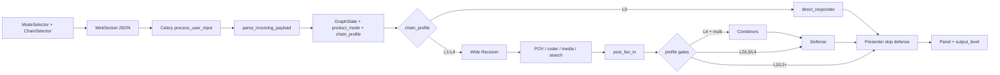

# TESS Engine — Phase 17 Session Opening Message

## Context

Phases 1–16 are complete. The live graph runs **POV agents**, **curator/editor combiners**, **defense**, **presenter**, and **product modes** (Research / Planner / Coding / Builder). Multi-POV pipelines complete within a **12-minute** Celery budget on CPX11 with `llama3.2:1b`.

Architecture docs: [AI_MAP.md](AI_MAP.md), [ROADMAP.md](ROADMAP.md), [SCHEMA.md](SCHEMA.md).

**Phase 17 goal:** Add user-selectable **chain profiles (L0–L4)** — output depth levels that gate which graph stages run — plus `output_level` on Panels and a **compare** UI for benchmarking the same question at different depths.

| Phase 16 baseline (reuse) | Phase 17 adds |
|---------------------------|---------------|
| Product modes + implicit depth bias | Explicit **L0–L4** chain profile selector |
| Single graph (always full chain today) | **Gated routing** — skip WR, defense, search, combiners per level |
| `product_mode` on state + Panels | `chain_profile` on request/state; `output_level` on Panels |
| JSON envelope `{ text, product_mode }` | Optional `chain_profile` in same envelope |
| Mode selector in header | **Chain profile selector** + optional compare view |

**Important:** Chain profiles are **depth gates on one graph**, not five separate LangGraphs. Phase 17 adds an L0 entry path and conditional skips; it does **not** rewrite the combiner/defense pipeline. Product modes (intent) and chain profiles (depth) are **orthogonal** — e.g. Research + L3, Coding + L1.

### Phase 16 baseline (shipped)

| Area | Status |
|------|--------|
| Product modes | `auto`, `research`, `planner`, `coding`, `builder` — registry in [`app/core/product_modes.py`](app/core/product_modes.py) |
| WS transport | Plain text → `auto`; JSON `{ text, product_mode }` via [`app/core/ws_payload.py`](app/core/ws_payload.py) |
| Research guard | Prunes unmatched POVs; industry topics → `researcher` + search ([`app/graph/routing.py`](app/graph/routing.py) `_apply_research_pov_guard`) |
| GraphState | `product_mode: str` on state + `build_initial_state()` |
| Panels | `product_mode` echoed on processing + completed Panels |
| Frontend | [`ModeSelector.tsx`](frontend/src/components/ModeSelector.tsx) in header |
| Tests | **37 total** — `test_pov_routing`, `test_combiner_utils`, `test_product_modes` |
| Canonical multi-POV | *"Design a science app UI covering aesthetics and usability"* → `art` + `ui_design` → combiners → defense |

**Known limits (16):**

- Implicit chain depth only — no `chain_profile` field yet; every message runs the **full L4-equivalent** graph (WR → agents → combiners-or-bypass → defense → presenter).
- `chain_profile` key in WS JSON is ignored today.
- No side-by-side compare UI; `output_level` not on Panels.

---

## Production

| Item | Value |
|------|-------|
| URL | http://5.78.186.223 (HTTP/IP mode) |
| Repo | https://github.com/sykis17/tess.git |
| Server path | `/opt/tess-engine` — deploy with `git pull && ./deploy/deploy.sh` |
| Local | Docker Compose + Ollama on Windows host; frontend `npm run dev` |
| Tests | `pytest tests/test_pov_routing.py tests/test_combiner_utils.py tests/test_product_modes.py` |

---

## Goal for Phase 17: Chain profiles (output levels)

Let the user pick **how deep** TESS processes a question — from a single direct LLM call (L0) to the full multi-agent synthesis chain (L4). The profile travels frontend → WebSocket → worker → `GraphState` → graph routing gates → `output_level` on Panels.

### Six profiles (first deploy)

| Profile | User label | Chain (effective) | Typical LLM calls | Use case |
|---------|------------|-------------------|---------------------|----------|
| `L0` | Direct | Single LLM → Presenter (no WR, no agents) | 1 | Baseline speed/quality benchmark |
| `L1` | Routed | WR → **one** specialist → Presenter | 2 | Fast single-domain answer |
| `L1+` | Parallel | WR → **1–3** specialists → Presenter (no combiners, no defense) | 2–4 | Multi-POV raw output, no synthesis |
| `L2` | Reviewed | L1 path + **Defense** | 3+ | QA-checked single-agent answer |
| `L3` | Grounded | L2 + **Search** (finder + reader when WR sets queries) | 4+ | Citations and source grounding |
| `L4` | Full chain | WR → parallel agents → **Combiners** (when multi-agent) → Defense → Presenter | 6+ | **Current default behavior** |

**Naming note:** `L1+` is the literal key (plus sign). Display label: **Parallel** or **L1+**.

### Default / backward compatibility

| Situation | Behavior |
|-----------|----------|
| `chain_profile` omitted, plain text WS | **`L4`** — current production graph unchanged |
| `chain_profile` omitted, JSON envelope | **`L4`** unless product mode supplies a default (see below) |
| Explicit `chain_profile` | Overrides product-mode default |
| Invalid `chain_profile` | Fall back to **`L4`** |

### Product mode → default chain profile (when `chain_profile` omitted)

Phase 16 documented implicit defaults; Phase 17 makes them explicit defaults only when user has **not** picked a level:

| `product_mode` | Default `chain_profile` |
|----------------|-------------------------|
| `auto` | `L4` |
| `research` | `L3` |
| `planner` | `L2` |
| `coding` | `L1` |
| `builder` | `L4` |

User can always override in the UI (e.g. Research + L0 for a quick baseline).

---

## Profile semantics (design detail)

### L0 — Direct

- **Skip:** Wide Receiver, all specialists, search, combiners, defense.
- **New node:** `direct_responder` — one LLM call with conversation history + user input; writes `collected_data` or a minimal `usable_answers` wrapper; Presenter formats Panel.
- **Processing Panel:** Show "Direct response…" immediately.
- **Use case:** "How fast/cheap is a raw model answer on this prompt?"

### L1 — Routed

- **WR:** Cap routing to **1 agent** (post-parse trim if WR returned 2–3).
- **After fan-in:** Skip combiners **and** defense → Presenter reads `mayor_data` / `collected_data` directly.
- **Search:** Do not fan out to `resource_finder` even if WR set `search_queries` (profile too low).
- **Use case:** Single-domain fast path with routing intelligence.

### L1+ — Parallel routed

- **WR:** Allow 1–3 agents (current behavior).
- **After fan-in:** Skip combiners **and** defense → Presenter concatenates per-agent sections (current bypass presenter path).
- **Search:** Skip search pipeline.
- **Use case:** See each POV lens separately without Micro synthesis (useful for comparing lenses before L4).

### L2 — Reviewed

- **WR:** Cap to **1 agent** (same as L1).
- **After fan-in:** Skip combiners; run **defense** on bypass-wrapped segments → Presenter.
- **Search:** Skip search pipeline.
- **Use case:** Planner mode default — structured output with QA pass, no combiner cost.

### L3 — Grounded

- **WR:** 1–3 agents allowed; **allow** `search_queries` and resource_finder fan-out.
- **After fan-in:** Skip combiners; run defense → Presenter (sources woven from `mayor_data`).
- **Use case:** Research mode default — citations + review, no multi-POV synthesis unless user picks L4.

### L4 — Full chain

- **Current graph** — no skips. Combiners when `should_bypass_combiners` is false; defense always; search when WR sets queries.
- **Use case:** Builder mode default; multi-POV synthesis; production baseline.

---

## Target data flow



### Request envelope (extend Phase 16)

**Plain text (legacy):** user message → `product_mode = auto`, `chain_profile = L4`.

**JSON (Phase 17):**

```json
{
  "text": "Explain photosynthesis with citations",
  "product_mode": "research",
  "chain_profile": "L3"
}
```

Optional future keys (ignore in 17 unless trivial): `project_id`, `compare_levels`.

### GraphState extension

```python
chain_profile: str  # "L0" | "L1" | "L1+" | "L2" | "L3" | "L4"
```

Set in `build_initial_state()` from worker; default resolved from product mode or `L4`.

### Panel extension

```python
output_level: str | None = None  # echo chain_profile used ("L0"–"L4")
```

Echo on processing + completed Panels (omit or `null` when default-only clients don't send profile — still echo resolved level for transparency).

---

## Code touchpoints (before Phase 17)

### WS payload — `product_mode` only today

```8:27:app/core/ws_payload.py
def parse_incoming_payload(raw: str) -> tuple[str, str]:
    """Return (user_text, product_mode). Plain text → (raw, 'auto')."""
    ...
    product_mode = validate_product_mode(data.get("product_mode"))
    return text.strip(), product_mode
```

**After Phase 17:** Extend to `parse_incoming_payload(raw) -> tuple[str, str, str]` → `(user_text, product_mode, chain_profile)`; or a small `IncomingRequest` Pydantic model. Resolve default profile via `resolve_chain_profile(chain_profile, product_mode)`.

### GraphState — no `chain_profile` yet

[`app/graph/state.py`](app/graph/state.py) — add `chain_profile: str`; `build_initial_state(..., chain_profile: str = "L4")`.

### Panel schema — `output_level` planned

[`app/graph/schemas.py`](app/graph/schemas.py) — add `output_level: str | None = None`.

### Graph builder — single entry, no L0 branch

```59:68:app/graph/builder.py
    builder.add_edge(START, "wide_receiver")
    builder.add_conditional_edges("wide_receiver", fan_out_from_wr)
    builder.add_conditional_edges("post_fan_in", route_after_fan_in)
    ...
    builder.add_conditional_edges("defense_review", route_after_defense)
    builder.add_edge("presenter", END)
```

**After Phase 17:**

- `START` → conditional: `L0` → `direct_responder` else `wide_receiver`.
- `route_after_fan_in` — consult `chain_profile`: L1/L1+ → presenter; L2/L3/L4 → defense or combiners per rules above.
- `fan_out_from_wr` — suppress search Send when profile &lt; L3.
- `route_after_defense` — skip retry loops when profile &lt; L4 (or keep bounded retries for L2+ only).
- WR post-parse: trim to 1 agent when profile is L1 or L2.

### Routing helpers — always full chain today

[`app/graph/routing.py`](app/graph/routing.py) — `route_after_fan_in` always combiners-or-defense; `should_predict_defense` always True. Gate these on `chain_profile` from state.

### Presenter — no `output_level` echo

[`app/graph/nodes/presenter.py`](app/graph/nodes/presenter.py) — add `output_level=state.get("chain_profile")` on Panel.

### Frontend — mode only, no chain selector

[`frontend/src/hooks/useWebSocket.ts`](frontend/src/hooks/useWebSocket.ts) — JSON when mode ≠ auto; add `chain_profile` when user picks non-default level.

---

## What's working (Phase 16 baseline to reuse)

| Concept | Behavior |
|---------|----------|
| **Full chain** | Today's graph ≡ **L4** — implement L4 as "no gates" first, then add skips |
| **Combiner bypass** | `should_bypass_combiners()` — single agent, no search reader |
| **Defense bypass path** | Presenter reads `mayor_data` when combiners bypassed — reuse for L1/L1+ |
| **Agent traces** | Compare UI diffs `agents_involved` + `agent_traces` per `output_level` |
| **Product modes** | Keep mode routing independent; chain profile gates depth only |
| **Research guard** | Still applies in Research mode before depth gates |

---

## Deliverables checklist

| # | Area | Work |
|---|------|------|
| 1 | **Chain registry** | `app/core/chain_profiles.py` — enum, display names, gate rules, `resolve_chain_profile()`, `default_for_product_mode()` |
| 2 | **WS payload** | Extend `parse_incoming_payload` + worker |
| 3 | **GraphState** | `chain_profile` field + `build_initial_state()` |
| 4 | **Panel schema** | `output_level` on Panel |
| 5 | **L0 node** | `app/graph/nodes/direct_responder.py` |
| 6 | **Graph builder** | START branch; wire `direct_responder` → presenter |
| 7 | **Chain gates** | `app/graph/chain_gates.py` (or extend `routing.py`) — `should_run_search`, `should_run_combiners`, `should_run_defense`, `max_parallel_agents_for_profile` |
| 8 | **Routing** | Gate `fan_out_from_wr`, `route_after_fan_in`, `route_after_defense`; WR agent cap for L1/L2 |
| 9 | **WR / Presenter** | Echo `output_level`; WR `agents_involved` prediction respects gates |
| 10 | **Frontend selector** | `ChainProfileSelector.tsx` + `App.tsx` header |
| 11 | **Frontend send** | `sendMessage(text, productMode?, chainProfile?)` |
| 12 | **Compare UI (v1)** | When "Compare" enabled: run 2–3 selected levels sequentially or parallel sessions; stack Panels with `output_level` badges; simple diff on `agent_traces` count / `agents_involved` |
| 13 | **Tests** | `tests/test_chain_profiles.py` — parse, defaults, gate logic, L0 path, backward compat |
| 14 | **Docs** | Update `AI_MAP.md`, `SCHEMA.md`, `ROADMAP.md`; mark Phase 17 complete |

---

## Implementation order

1. [`app/core/chain_profiles.py`](app/core/chain_profiles.py) — registry + validation + defaults
2. [`app/core/ws_payload.py`](app/core/ws_payload.py) — parse `chain_profile`; resolve defaults
3. [`app/graph/state.py`](app/graph/state.py) + [`app/graph/schemas.py`](app/graph/schemas.py)
4. [`app/worker.py`](app/worker.py) — pass `chain_profile` into initial state
5. [`app/graph/chain_gates.py`](app/graph/chain_gates.py) — pure gate functions (unit-testable)
6. [`app/graph/nodes/direct_responder.py`](app/graph/nodes/direct_responder.py) — L0
7. [`app/graph/builder.py`](app/graph/builder.py) — START branch + edges
8. [`app/graph/routing.py`](app/graph/routing.py) — gate fan-out and post-fan-in
9. [`app/graph/nodes/wide_receiver.py`](app/graph/nodes/wide_receiver.py) — agent cap, prediction badges
10. [`app/graph/nodes/presenter.py`](app/graph/nodes/presenter.py) — `output_level` echo
11. Frontend: `types` → `useWebSocket` → `ChainProfileSelector` → `App` → `PanelCard` badge
12. Compare UI (minimal v1)
13. [`tests/test_chain_profiles.py`](tests/test_chain_profiles.py)
14. Docs + deploy

---

## Implementation notes

### Chain gates (recommended API)

```python
# app/graph/chain_gates.py
def allows_wide_receiver(profile: str) -> bool: ...
def allows_search(profile: str) -> bool: ...
def allows_combiners(profile: str) -> bool: ...
def allows_defense(profile: str) -> bool: ...
def max_routed_agents(profile: str) -> int: ...  # L1/L2 → 1; L1+ → 3; etc.
```

Call from `fan_out_from_wr`, `route_after_fan_in`, `parse_routing_decision` (post-trim), and WR `agents_involved` prediction.

### L0 direct responder sketch

```python
async def direct_responder_node(state: GraphState) -> dict[str, Any]:
    # LLM with conversation_history + user_input
    # Append to collected_data; optional processing Panel
    # No WR trace; agent_traces entry for direct_responder
```

Use `general_assistant` system prompt or a minimal "answer directly" prompt — keep compact for small models.

### WR agent cap (L1 / L2)

After `parse_routing_decision`, if `max_routed_agents(chain_profile) == 1` and len(agents) > 1:

- Keep first agent (or best keyword-matched agent); log trim.

### Compare UI (v1 — minimal)

- Checkbox or toggle: **Compare levels**
- Multi-select 2–3 profiles (e.g. L0, L2, L4)
- On send: queue one Celery task per level (same `text`, same `product_mode`, different `chain_profile`) — use distinct `panel_id` per run or a `compare_group_id` in state (optional Phase 17.1)
- Frontend stacks resulting Panels grouped by `output_level`
- Expandable **diff summary**: agent count, pipeline string, content length — full text diff optional

Do **not** block Phase 17 ship on fancy diff; level selector + `output_level` echo is MVP.

### Interaction with product modes

| Example | Mode | Profile | Expected |
|---------|------|---------|----------|
| Quick baseline | research | L0 | Direct answer, no search |
| Grounded cite | research | L3 | researcher + search + defense, no combiners |
| Full synthesis | research | L4 | Multi-agent + combiners when WR alarms 2+ |
| Fast code | coding | L1 | coder only, no defense |
| Aviation industry | research | L3 | researcher + search (guard), defense, no combiners |

---

## Test matrix (Phase 17)

Assume JSON envelope with explicit `chain_profile` unless testing defaults.

| Profile | Input | Expect |
|---------|-------|--------|
| `L0` | "What is photosynthesis?" | No WR; 1 LLM; `output_level: L0`; fast Panel |
| `L1` | "Write a Python sort function" | WR → `coder` only; no defense; no combiners |
| `L1+` | Multi-POV UI design prompt | WR → `art` + `ui_design`; presenter sections; no combiners/defense |
| `L2` | "Plan a 2-week sprint" + planner mode | WR → 1 agent; defense runs; no combiners |
| `L3` | "Explain X with citations" + research | search + defense; no combiners (single agent) |
| `L4` | Multi-POV UI design prompt | Full chain — combiners + defense |
| default | Plain text, no profile | `L4` behavior (backward compat) |
| default | research mode, no profile | Resolves to `L3` |

**Regression:** All 37 Phase 16 tests green; POV override and research guard unchanged.

```bash
pytest tests/test_pov_routing.py tests/test_combiner_utils.py tests/test_product_modes.py
pytest tests/test_chain_profiles.py
```

---

## Out of scope for Phase 17 (future phases)

| Phase | Feature |
|-------|---------|
| **18** | Pipeline status wall + results wall from folder tree |
| **19** | Drill-down titles, context-related/deviating questions, top-10 lists, 4 choice themes |
| **20** | Token streaming; `interruption_flag` mid-chain steer |
| Post-17 | Parallel compare in one Celery task; `compare_group_id` schema; automated quality scoring across levels |

---

## Constraints

- Follow `.cursorrules` (async, Pydantic, Celery for heavy work, modular structure).
- CPX11 / `llama3.2:1b` — L0/L1 must stay fast; avoid extra prompt bloat.
- **Backward compatible:** omitting `chain_profile` must preserve today's L4 behavior for plain-text clients.
- Never return `{}` from nodes.
- Gate logic in **pure functions** (`chain_gates.py`) for testability.
- Do not regress Phase 15B POV override, 15C combiners, or 16 product modes / research guard.

---

## Key files (Phase 16 baseline)

| Area | Path |
|------|------|
| Graph | [`app/graph/builder.py`](app/graph/builder.py) |
| Chain (new) | `app/core/chain_profiles.py`, `app/graph/chain_gates.py`, `app/graph/nodes/direct_responder.py` |
| Modes | [`app/core/product_modes.py`](app/core/product_modes.py), [`app/graph/routing.py`](app/graph/routing.py) |
| WR | [`app/graph/nodes/wide_receiver.py`](app/graph/nodes/wide_receiver.py) |
| Combiners / defense | [`app/graph/combiner_utils.py`](app/graph/combiner_utils.py), [`app/graph/defense_utils.py`](app/graph/defense_utils.py) |
| State / schema | [`app/graph/state.py`](app/graph/state.py), [`app/graph/schemas.py`](app/graph/schemas.py) |
| Worker / WS | [`app/worker.py`](app/worker.py), [`app/api/ws.py`](app/api/ws.py) |
| Frontend | [`frontend/src/App.tsx`](frontend/src/App.tsx), [`ModeSelector.tsx`](frontend/src/components/ModeSelector.tsx), [`useWebSocket.ts`](frontend/src/hooks/useWebSocket.ts) |

**New files (expected):**

| Area | Path |
|------|------|
| Chain registry | `app/core/chain_profiles.py` |
| Gate helpers | `app/graph/chain_gates.py` |
| L0 node | `app/graph/nodes/direct_responder.py` |
| Chain tests | `tests/test_chain_profiles.py` |
| Chain selector UI | `frontend/src/components/ChainProfileSelector.tsx` |

---

## Try it / Verify locally

**Baseline (must stay green before and after Phase 17):**

```bash
pytest tests/test_pov_routing.py tests/test_combiner_utils.py tests/test_product_modes.py
```

**After Phase 17:**

```bash
pytest tests/test_chain_profiles.py
docker compose restart worker
```

| Profile | Send | Expect |
|---------|------|--------|
| `L0` | JSON: `{"text": "Hey, how are you?", "chain_profile": "L0"}` | Direct Panel; no WR in traces |
| `L4` | Plain text (legacy) | Same as today |
| `L1+` | JSON multi-POV design prompt + `"chain_profile": "L1+"` | 2 agents; separate sections; no defense |
| research + no profile | JSON research envelope only | Default `L3`; search when appropriate |

**UI checks:**

- Chain selector visible in header beside Mode selector.
- Completed Panel shows `output_level` chip (e.g. **L3**).
- Compare toggle runs multiple levels and stacks Panels with level badges.

**Canonical L4 regression:**

*"Design a science app UI covering aesthetics and usability"* at `L4` → `art` + `ui_design` → combiners → defense (unchanged from Phase 16).

---

## Docs update checklist (when Phase 17 ships)

| Doc | Change |
|-----|--------|
| [AI_MAP.md](AI_MAP.md) | Mark output levels **live**; update "Proposed" → "Live" for L0–L4 |
| [SCHEMA.md](SCHEMA.md) | `output_level` + `chain_profile` Planned → Live; document WS envelope |
| [ROADMAP.md](ROADMAP.md) | Check off Phase 17; move Phase 18 to "Next" |
| [README.md](README.md) | Update current graph line to Phase 17; note chain selector |

---

## Request

Please review [AI_MAP.md](AI_MAP.md) (Output Levels), [SCHEMA.md](SCHEMA.md) (chain profiles), and [ROADMAP.md](ROADMAP.md) before starting.

**Goal:** Implement Phase 17 chain profiles — L0 direct path, L1–L4 gates on the existing graph, `chain_profile` / `output_level` on state and Panels, frontend chain selector + minimal compare UI, tests, docs, commit + deploy.

**Start command for a new chat:**

> Implement Phase 17 per PHASE_17_OPENER.md

---

## Glossary

| Term | Meaning |
|------|---------|
| Chain profile | Output depth L0–L4 — which graph stages run |
| Product mode | Intent profile (research, planner, …) — how WR routes |
| `output_level` | Echo of `chain_profile` on Panels for compare UI |
| L4 default | Today's full graph — backward-compat baseline |
| Gate | Pure function that skips search/combiners/defense/WR based on profile |
| Compare mode | Run same prompt at multiple levels; stack Panels side-by-side |
