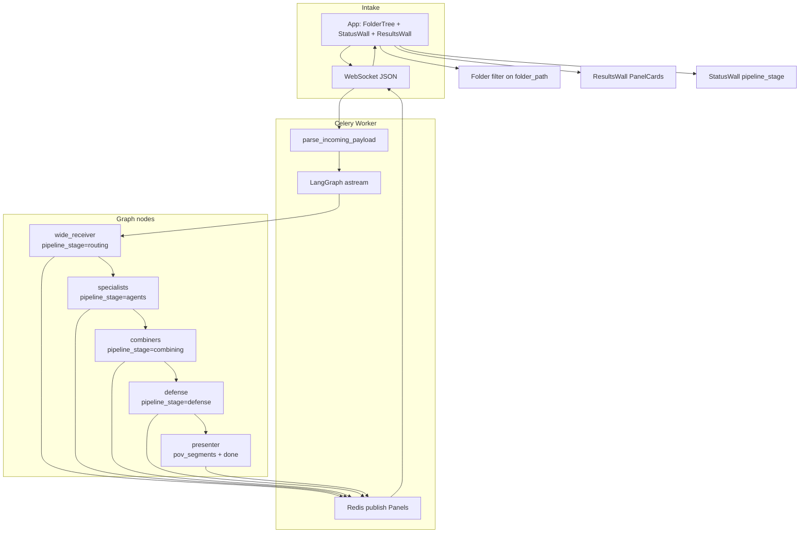

# TESS Engine — Phase 18 Session Opening Message

## Context

Phases 1–17 are complete. The live graph runs **POV agents**, **curator/editor combiners**, **defense**, **presenter**, **product modes** (Research / Planner / Coding / Builder), and **chain profiles** (L0–L4 depth gates). Multi-POV pipelines complete within a **12-minute** Celery budget on CPX11 with `llama3.2:1b`.

Architecture docs: [AI_MAP.md](AI_MAP.md), [ROADMAP.md](ROADMAP.md), [SCHEMA.md](SCHEMA.md).

**Phase 18 goal:** Add a **pipeline status wall** (persistent progress UI from WR through Presenter) and a **results wall** driven by **virtual folder-tree navigation** — plus structured **POV segments** on completed Panels so users see which lens contributed what.

| Phase 17 baseline (reuse) | Phase 18 adds |
|---------------------------|---------------|
| Linear `panel-list` in `App.tsx` main | **Folder tree sidebar** + **results wall** filtered by virtual folder |
| Per-Panel `agents_involved` badges | **Persistent status wall** — predicted + live pipeline stage |
| `folder_path` label on each PanelCard | Tree nodes from agent `folder_path` registry; click → filter wall |
| `pov_sources` chips (aggregate lenses) | **`pov_segments`** — per-segment title, content, source POV |
| WR processing Panel + combiner mid-stream panels | **`pipeline_stage`** on every streamed Panel |
| Compare UI stacks Panels by `output_level` | Status wall + folder filter work alongside compare mode |

**Important:** The folder tree is a **virtual navigation model** built from agent `folder_path` values (e.g. `Science/Chemistry`, `Design/UI`). It does **not** imply a filesystem or project workspace yet. Phase 18 organizes **session Panels** by folder — not persistent cross-session storage.

### Phase 17 baseline (shipped)

| Area | Status |
|------|--------|
| Chain profiles | `L0`–`L4` (+ `L1+`) — registry in [`app/core/chain_profiles.py`](app/core/chain_profiles.py); gates in [`app/graph/chain_gates.py`](app/graph/chain_gates.py) |
| L0 path | [`app/graph/nodes/direct_responder.py`](app/graph/nodes/direct_responder.py) → presenter (skips WR) |
| WS transport | Plain text → `auto` + `L4`; JSON `{ text, product_mode?, chain_profile? }` via [`app/core/ws_payload.py`](app/core/ws_payload.py) |
| GraphState | `product_mode`, `chain_profile` on state + `build_initial_state()` |
| Panels | `product_mode`, `output_level`, `pov_sources`, `agents_involved`, `agent_traces`, `data_tier` |
| Frontend selectors | [`ModeSelector.tsx`](frontend/src/components/ModeSelector.tsx), [`ChainProfileSelector.tsx`](frontend/src/components/ChainProfileSelector.tsx) in header |
| Compare UI | [`CompareLevelsToggle.tsx`](frontend/src/components/CompareLevelsToggle.tsx), [`CompareSummary.tsx`](frontend/src/components/CompareSummary.tsx); multi-send with pending count in [`useWebSocket.ts`](frontend/src/hooks/useWebSocket.ts) |
| Panel rendering | [`PanelCard.tsx`](frontend/src/components/PanelCard.tsx) — folder label, level/mode chips, POV badges, agent pipeline, collapsible traces |
| Mid-stream progress | Combiner nodes call [`publish_panel`](app/graph/panel_stream.py) for long LLM stages; worker streams all node Panels via `astream` |
| Tests | **61 total** — `test_pov_routing` (13), `test_combiner_utils` (7), `test_product_modes` (17), `test_chain_profiles` (24) |
| Canonical multi-POV | *"Design a science app UI covering aesthetics and usability"* at `L4` → `art` + `ui_design` → combiners → defense |

**Known limits (17):**

- **No status wall** — only a generic `"TESS is thinking…"` banner and per-Panel `agents_involved` badges; no cross-Panel pipeline tracker.
- **No folder tree** — `folder_path` is a text label on each card; Panels render in arrival order in one vertical list.
- **No `pipeline_stage`** — frontend cannot distinguish routing vs agents vs combining vs defense without parsing `agents_involved` heuristics.
- **POV segments not structured** — multi-POV content is markdown `##` headers inside `content`; `source_agents` from `UsableAnswer` / `MayorData` is not exposed on the Panel JSON.
- **Session-scoped only** — Panels live in React state per WebSocket session; no folder persistence across reloads.

---

## Production

| Item | Value |
|------|-------|
| URL | http://5.78.186.223 (HTTP/IP mode) |
| Repo | https://github.com/sykis17/tess.git |
| Server path | `/opt/tess-engine` — deploy with `git pull && ./deploy/deploy.sh` |
| Local | Docker Compose + Ollama on Windows host; frontend `npm run dev` |
| Tests | `pytest tests/test_pov_routing.py tests/test_combiner_utils.py tests/test_product_modes.py tests/test_chain_profiles.py` |

---

## Goal for Phase 18: Status wall + results wall

Give users **continuous visibility** into what TESS is doing and **navigable access** to past results organized by virtual subject folders.

### Three deliverables

| # | Feature | User experience |
|---|---------|-----------------|
| 1 | **Status wall / info bar** | Sticky bar below header shows predicted pipeline (from WR), current `pipeline_stage`, active agent badges, and elapsed time while processing |
| 2 | **Results wall + folder tree** | Left sidebar lists virtual folders from agent registry; selecting a folder filters the main wall to Panels whose `folder_path` matches that branch |
| 3 | **POV segments on completed Panels** | Multi-lens answers render as titled segments with POV/source badges — not only buried in markdown `content` |

### Virtual folder tree (first deploy)

Built from [`AGENT_REGISTRY`](app/agents/registry.py) `folder_path` values — no new backend folder DB:

| Branch | Leaf folders |
|--------|--------------|
| `Science/` | `Chemistry`, `Biology` |
| `Social Studies/` | `Economics` |
| `Arts/` | `Visual` |
| `Design/` | `UI` |
| `Coding/` | `Projects` |
| `Research/` | `Topics` |
| `Assistant/` | `General` |
| `Media/` | `Photo`, `Video`, `Audio` |

**Panel → folder mapping (unchanged):** each Panel's `folder_path` is set by the primary routed agent (e.g. `art` → `Arts/Visual`). Multi-agent runs use the **first** routed agent's folder for the processing Panel; completed Panel follows the same rule today in [`presenter.py`](app/graph/nodes/presenter.py) `_resolve_folder_path`.

**Results wall behavior:**

- Default view: **All** — every Panel in the session (current behavior, enhanced layout).
- Folder selected: show Panels where `folder_path` equals the leaf path **or** starts with `branch/` when a branch node is selected (optional v1 — leaf-only filter is acceptable MVP).
- Show per-folder **completed count** badge on tree nodes.
- Compare-mode Panels remain visible in the wall; status wall tracks the **latest in-flight** `panel_id` (or all in-flight when compare sends multiple tasks).

### `pipeline_stage` values

| Stage | When set | Typical `agents_involved` context |
|-------|----------|-----------------------------------|
| `routing` | WR processing Panel | Wide Receiver |
| `agents` | Specialists running; fan-in wait | POV / coder / media / search agents |
| `combining` | Combiner mayor/micro/collector | Combiner Mayor, Micro, Collector |
| `defense` | Defense delegator/review; `review_passed` Panel | Defense Delegator, Defense Review |
| `presenting` | Presenter node (brief) | Presenter |
| `done` | `status: completed` | Full pipeline echoed |

L0 direct path: `routing` skipped → first stage `presenting` (or a dedicated `direct` stage — pick one and document).

---

## Design choices / architecture

### Layout (target)

```
┌─────────────────────────────────────────────────────────────┐
│ Header: Mode + Depth + Connection                           │
│ Compare toggle (optional)                                   │
├─────────────────────────────────────────────────────────────┤
│ StatusWall: [stage] ─ WR → Agents → Combine → Defense → ✓  │
├──────────────┬──────────────────────────────────────────────┤
│ FolderTree   │ ResultsWall                                  │
│  ▼ Science   │  [PanelCard …]                               │
│    Chemistry │  [PanelCard …]                               │
│  ▼ Design    │                                              │
│    UI        │                                              │
├──────────────┴──────────────────────────────────────────────┤
│ MessageInput                                                │
└─────────────────────────────────────────────────────────────┘
```

- **Status wall** reads from the **latest processing** Panel for the active run (`status === "processing"` or `review_passed`), keyed by `panel_id`. When compare mode fires multiple tasks, show a compact multi-track bar or the most recently updated in-flight Panel (document choice in implementation).
- **Folder tree** is a **static tree** derived from agent configs (frontend build from a shared manifest **or** lightweight `GET /api/folders` — prefer shared TS constant generated from same paths as Python registry to avoid drift in v1).
- **Results wall** is a filtered `panel-list`; reuse [`PanelCard`](frontend/src/components/PanelCard.tsx) with new segment renderer.
- **POV segments** ship as structured JSON on completed Panels — do **not** rely on markdown parsing in the frontend.

### `PanelSegment` schema (new)

```python
class PanelSegment(BaseModel):
    title: str
    content: str
    source_agents: list[str] = Field(default_factory=list)
    pov: str | None = None  # display lens, e.g. "Art", "UI Design"
```

Populate in **presenter** (and optionally L1+ bypass path):

| Path | Segment source |
|------|----------------|
| Combiner + defense (`usable_answers`) | One segment per `UsableAnswer` — `title`, `content`, `source_agents` |
| Multi-agent bypass (`mayor_data`) | One segment per specialist `MayorData` entry — `pov` or agent display name as title |
| Single-agent | Omit `pov_segments` or single-item list — frontend falls back to `PanelContent` |

Keep `content` as the full markdown body for backward compatibility; `pov_segments` is additive.

### Status wall data source

**Backend (recommended):** add `pipeline_stage: str` to [`Panel`](app/graph/schemas.py). Set on every Panel emitted by WR, combiners, defense, presenter, and `direct_responder`. Frontend status wall subscribes to WebSocket Panel updates — no new WS message type in v1.

**Frontend:** new hook `usePipelineStatus(panels)` derives:

- `currentStage` from latest in-flight Panel's `pipeline_stage`
- `predictedSteps` from first processing Panel's `agents_involved`
- `completedSteps` by diffing trace agent names or stage progression

Optional: `stage_message` reuse existing Panel `content` for the status subtitle (e.g. "Sorting and cataloging Art + UI Design perspectives…").

---

## Target data flow



### Panel extension (Phase 18)

```python
pipeline_stage: str | None = None  # routing | agents | combining | defense | presenting | done
pov_segments: list[PanelSegment] = Field(default_factory=list)
```

Echo `pipeline_stage` on processing, `review_passed`, and completed Panels. Set `pipeline_stage="done"` on completed; omit or `null` on legacy clients.

---

## Code touchpoints (before Phase 18)

### Frontend — linear list, no tree or status bar

```97:134:frontend/src/App.tsx
      <main className="app-main">
        {isProcessing && (
          <p className="app-main__processing">
            TESS is thinking… (first Ollama response can take up to a minute)
          </p>
        )}
        ...
          <div className="panel-list">
            {panels.map((panel) => (
              <PanelCard
                key={panel.panel_id}
                folderPath={panel.folder_path}
                ...
              />
            ))}
```

**After Phase 18:** Replace generic processing banner with `<StatusWall />`. Wrap main in sidebar + `<ResultsWall panels={filtered} />`. Filter `panels` by selected folder from `<FolderTree />`.

### PanelCard — folder label only, no segments

```53:91:frontend/src/components/PanelCard.tsx
      <header className="panel-card__header">
        ...
          <span className="panel-card__folder">{folderPath}</span>
        ...
      </header>
      ...
      {povSources.length > 0 && (
        <div className="panel-card__pov-sources">
          {povSources.map((pov) => (
            <span key={pov} className="panel-card__pov-badge">{pov}</span>
          ))}
        </div>
      )}
```

**After Phase 18:** Add `<PanelSegments segments={povSegments} />` when `pov_segments.length > 0`; each segment shows title, POV badge(s), and content. Keep aggregate `pov_sources` row for single-lens quick scan.

### useWebSocket — no pipeline_stage merge

```89:97:frontend/src/hooks/useWebSocket.ts
              updated[existingIndex] = {
                ...data,
                pov_sources: ...
                product_mode: data.product_mode ?? existing.product_mode,
                output_level: data.output_level ?? existing.output_level,
              };
```

**After Phase 18:** Merge `pipeline_stage` and `pov_segments` with same sticky rules (prefer non-empty incoming segments on completed Panel).

### Panel schema — no pipeline_stage or segments

```95:109:app/graph/schemas.py
class Panel(BaseModel):
  ...
    product_mode: str | None = None
    output_level: str | None = None
```

**After Phase 18:** Add `PanelSegment`, `pipeline_stage`, `pov_segments` fields.

### WR processing Panel — no pipeline_stage

```107:119:app/graph/nodes/wide_receiver.py
    processing_panel = Panel(
        panel_id=state["panel_id"],
        folder_path=_resolve_folder_path_for_agent(routed_agents[0]),
        status="processing",
        ...
        agents_involved=agents_involved,
```

**After Phase 18:** `pipeline_stage="routing"` on WR Panel; combiner/defense nodes set `combining` / `defense`; specialist mid-progress panels (via `publish_panel`) set `agents`.

### Presenter — markdown only, no structured segments

```183:196:app/graph/nodes/presenter.py
    panel = Panel(
        ...
        content=content,
        ...
        pov_sources=collect_pov_sources(active_agents),
        output_level=state.get("chain_profile"),
    )
```

**After Phase 18:** Build `pov_segments` from `usable_answers` or multi-entry `mayor_data`; set `pipeline_stage="done"`.

---

## What's working (Phase 17 baseline to reuse)

| Concept | Behavior |
|---------|----------|
| **Incremental Panels** | Worker `astream` + `publish_panel` — status wall can react to every Panel without new transport |
| **`agents_involved`** | WR predicts full pipeline (combiners/defense gated by `chain_profile`) — use as status wall step list |
| **`folder_path`** | Already on every Panel from agent config — folder tree is a view layer, not a new routing concept |
| **`pov_sources`** | Aggregate lenses on Panel — segment `pov` field complements this |
| **`data_tier`** | Intermediate combiner Panels (`mayor`, `micro`, `usable`) — optional in results wall or hidden behind "Show intermediate" toggle |
| **Compare mode** | Multiple concurrent `panel_id`s — status wall should handle `pendingCount > 1` |
| **Chain profile gates** | L0 skips WR (status wall shows shorter pipeline); L1+ may skip combiners/defense — stage list must respect gates |

---

## Deliverables checklist

| # | Area | Work |
|---|------|------|
| 1 | **Schema** | `PanelSegment`, `pipeline_stage`, `pov_segments` on `Panel` in [`app/graph/schemas.py`](app/graph/schemas.py) |
| 2 | **Stage helper** | `app/graph/pipeline_stages.py` — constants, `stage_for_node(node_name)`, gate-aware predicted stages |
| 3 | **WR / specialists** | Set `pipeline_stage` on processing Panels; specialist progress panels → `agents` |
| 4 | **Combiners / defense** | `combining` / `defense` on intermediate and `review_passed` Panels |
| 5 | **Presenter** | Build `pov_segments`; `pipeline_stage="done"` on completed Panel |
| 6 | **Direct responder** | `pipeline_stage` for L0 path |
| 7 | **Folder manifest** | `app/core/folder_tree.py` or export from agent registry; mirror in `frontend/src/data/folderTree.ts` |
| 8 | **StatusWall** | `frontend/src/components/StatusWall.tsx` + `usePipelineStatus.ts` |
| 9 | **FolderTree** | `frontend/src/components/FolderTree.tsx` — select folder, badge counts |
| 10 | **ResultsWall** | `frontend/src/components/ResultsWall.tsx` — filtered panel list |
| 11 | **PanelSegments** | `frontend/src/components/PanelSegments.tsx` — render structured segments |
| 12 | **App layout** | Refactor [`App.tsx`](frontend/src/App.tsx) — sidebar + status bar + wall |
| 13 | **Types** | Extend [`frontend/src/types/panel.ts`](frontend/src/types/panel.ts) |
| 14 | **Tests** | `tests/test_pipeline_stages.py`, `tests/test_pov_segments.py` (presenter segment building) |
| 15 | **Docs** | Update `AI_MAP.md`, `SCHEMA.md`, `ROADMAP.md`; mark Phase 18 complete |

---

## Implementation order

1. [`app/graph/schemas.py`](app/graph/schemas.py) — `PanelSegment`, `pipeline_stage`, `pov_segments`
2. [`app/graph/pipeline_stages.py`](app/graph/pipeline_stages.py) — stage constants + node→stage mapping
3. [`app/graph/nodes/wide_receiver.py`](app/graph/nodes/wide_receiver.py) — `pipeline_stage="routing"`
4. [`app/graph/nodes/direct_responder.py`](app/graph/nodes/direct_responder.py) — L0 stage
5. Combiner + defense nodes — `combining` / `defense` on streamed Panels
6. [`app/graph/nodes/presenter.py`](app/graph/nodes/presenter.py) — `pov_segments` builder + `done`
7. [`app/core/folder_tree.py`](app/core/folder_tree.py) — virtual tree from `AGENT_REGISTRY`
8. Frontend types + `useWebSocket` merge logic
9. `usePipelineStatus` hook
10. `StatusWall` component
11. `folderTree.ts` + `FolderTree` component
12. `ResultsWall` + `PanelSegments`
13. [`App.tsx`](frontend/src/App.tsx) layout refactor + CSS
14. [`tests/test_pipeline_stages.py`](tests/test_pipeline_stages.py), [`tests/test_pov_segments.py`](tests/test_pov_segments.py)
15. Docs + deploy

---

## Implementation notes

### Stage mapping (recommended)

```python
# app/graph/pipeline_stages.py
class PipelineStage:
    ROUTING = "routing"
    AGENTS = "agents"
    COMBINING = "combining"
    DEFENSE = "defense"
    PRESENTING = "presenting"
    DONE = "done"

_NODE_STAGE: dict[str, str] = {
    "wide_receiver": PipelineStage.ROUTING,
    "direct_responder": PipelineStage.PRESENTING,
    "combiner_mayor": PipelineStage.COMBINING,
    "combiner_micro": PipelineStage.COMBINING,
    "collector": PipelineStage.COMBINING,
    "defense_delegator": PipelineStage.DEFENSE,
    "defense_review": PipelineStage.DEFENSE,
    "presenter": PipelineStage.DONE,
}
# Specialists → AGENTS when emitting progress panels
```

### Predicted pipeline for status wall (gate-aware)

Reuse [`build_panel_agents_involved`](app/graph/defense_utils.py) logic from WR's first processing Panel. Map display names to stage groups:

| Display group | Stage |
|---------------|-------|
| Wide Receiver | `routing` |
| Chemistry, Art, Coder, … | `agents` |
| Combiner Mayor / Micro / Collector | `combining` |
| Defense Delegator / Review | `defense` |
| Presenter | `presenting` |

When `chain_profile` is L0, predicted steps = Direct Responder → Presenter. When L1+, omit defense/combiners per [`chain_gates.py`](app/graph/chain_gates.py).

### POV segment builder (presenter sketch)

```python
def build_pov_segments(
    usable_answers: list[UsableAnswer],
    mayor_data: list[MayorData],
    active_agents: list[str],
) -> list[PanelSegment]:
    if usable_answers:
        return [
            PanelSegment(
                title=a.title,
                content=a.content,
                source_agents=a.source_agents,
                pov=_pov_label_for_agents(a.source_agents),
            )
            for a in sort_usable_answers(usable_answers)
        ]
    specialists = [e for e in order_mayor_data(mayor_data, active_agents)
                   if e.source_agent != "resource_reader"]
    if len(specialists) > 1:
        return [
            PanelSegment(
                title=e.pov or format_agent_display_name(e.source_agent),
                content=e.content,
                source_agents=[e.source_agent],
                pov=e.pov,
            )
            for e in specialists
        ]
    return []
```

### Folder tree (frontend)

```typescript
// frontend/src/data/folderTree.ts — keep paths in sync with app/core/folder_tree.py
export const FOLDER_TREE = [
  { label: "Science", children: ["Science/Chemistry", "Science/Biology"] },
  { label: "Design", children: ["Design/UI"] },
  ...
] as const;
```

`countPanelsForFolder(panels, path)` — match exact `folder_path` for leaf; optional prefix match for branch nodes.

### Intermediate Panels in results wall

**MVP:** Hide `data_tier` in (`mayor`, `micro`, `usable`) from the default wall view — show only `processing` (latest per `panel_id`), `review_passed`, and `completed`. Optional toggle "Show pipeline details" reveals intermediate tiers for debugging.

### Compare mode + status wall

When compare sends L0 + L4:

- `pendingCountRef` already tracks multiple in-flight tasks in [`useWebSocket.ts`](frontend/src/hooks/useWebSocket.ts).
- Status wall v1: show **two compact tracks** (level badge + stage) or cycle focus to the most recently updated processing Panel.
- Do **not** block Phase 18 ship on perfect multi-track UX — single-track for one message, simplified multi for compare.

---

## Test matrix (Phase 18)

| Scenario | Input | Expect |
|----------|-------|--------|
| Status — routing | Any L4 message | First Panel has `pipeline_stage: routing`, `agents_involved` lists predicted pipeline |
| Status — combining | Multi-POV L4 prompt | Mid-stream Panel with `pipeline_stage: combining` during mayor/micro |
| Status — done | Completed Panel | `pipeline_stage: done`, `status: completed` |
| Segments — multi-POV | Canonical UI design prompt at L4 | Completed Panel has `pov_segments` ≥ 2 with distinct `pov` / `source_agents` |
| Segments — single | L1 coding prompt | `pov_segments` empty or length 1; `PanelContent` still works |
| Segments — L1+ bypass | Multi-POV at `L1+` | Segments from `mayor_data` per specialist |
| Folder filter | Complete chemistry + art prompts | Tree shows counts; selecting `Science/Chemistry` shows only chemistry `folder_path` Panels |
| L0 status | `chain_profile: L0` | Status wall shows Direct → Presenter (no routing stage) |
| Backward compat | Plain text client | Missing `pipeline_stage` / `pov_segments` — UI degrades gracefully |
| Regression | Phase 17 chain tests | All 61 existing tests green |

```bash
pytest tests/test_pov_routing.py tests/test_combiner_utils.py tests/test_product_modes.py tests/test_chain_profiles.py
pytest tests/test_pipeline_stages.py tests/test_pov_segments.py
```

---

## Out of scope for Phase 18 (future phases)

| Phase | Feature |
|-------|---------|
| **19** | Drill-down titles, context-related/deviating questions, top-10 lists, 4 choice themes |
| **20** | Token streaming; `interruption_flag` mid-chain steer |
| Post-18 | Cross-session folder persistence (DB/Redis); drag-and-drop Panels between folders |
| Post-18 | Real project workspaces (files, repos); user-defined folders |
| Post-18 | ETA prediction ML; animated graph visualization |

---

## Constraints

- Follow `.cursorrules` (async, Pydantic, Celery for heavy work, modular structure).
- **Backward compatible:** new Panel fields optional; frontend must render Panels without `pipeline_stage` or `pov_segments`.
- Keep folder tree paths **identical** to agent `folder_path` strings — no alternate slug scheme in v1.
- Status wall must not block message input; results wall scrolls independently of sidebar.
- English for user-facing text and comments.
- Never return `{}` from nodes.
- Do not regress Phase 17 chain gates, compare UI, or Phase 16 product modes.

---

## Key files (Phase 17 baseline)

| Area | Path |
|------|------|
| Graph | [`app/graph/builder.py`](app/graph/builder.py) |
| Chain | [`app/core/chain_profiles.py`](app/core/chain_profiles.py), [`app/graph/chain_gates.py`](app/graph/chain_gates.py) |
| WR / Presenter | [`app/graph/nodes/wide_receiver.py`](app/graph/nodes/wide_receiver.py), [`app/graph/nodes/presenter.py`](app/graph/nodes/presenter.py) |
| Panel stream | [`app/graph/panel_stream.py`](app/graph/panel_stream.py) |
| Agent registry | [`app/agents/registry.py`](app/agents/registry.py) |
| Schemas | [`app/graph/schemas.py`](app/graph/schemas.py), [`SCHEMA.md`](SCHEMA.md) |
| Worker / WS | [`app/worker.py`](app/worker.py), [`app/api/ws.py`](app/api/ws.py) |
| Frontend | [`frontend/src/App.tsx`](frontend/src/App.tsx), [`PanelCard.tsx`](frontend/src/components/PanelCard.tsx), [`useWebSocket.ts`](frontend/src/hooks/useWebSocket.ts) |

**New files (expected):**

| Area | Path |
|------|------|
| Pipeline stages | `app/graph/pipeline_stages.py` |
| Folder tree (backend) | `app/core/folder_tree.py` |
| Stage / segment tests | `tests/test_pipeline_stages.py`, `tests/test_pov_segments.py` |
| Status wall | `frontend/src/components/StatusWall.tsx`, `frontend/src/hooks/usePipelineStatus.ts` |
| Folder / results UI | `frontend/src/components/FolderTree.tsx`, `ResultsWall.tsx`, `PanelSegments.tsx` |
| Folder manifest | `frontend/src/data/folderTree.ts` |

---

## Try it / Verify locally

**Baseline (must stay green before and after Phase 18):**

```bash
pytest tests/test_pov_routing.py tests/test_combiner_utils.py tests/test_product_modes.py tests/test_chain_profiles.py
```

**After Phase 18:**

```bash
pytest tests/test_pipeline_stages.py tests/test_pov_segments.py
docker compose restart worker
cd frontend && npm run dev
```

| Check | Action | Expect |
|-------|--------|--------|
| Status wall | Send any message | Sticky bar shows stage progression routing → … → done |
| Folder tree | Send chemistry + UI prompts | Tree badges update; click `Science/Chemistry` filters wall |
| POV segments | Multi-POV L4 canonical prompt | Completed card shows titled segments with POV badges |
| Compare | Enable L0 + L4 compare | Status wall + folder filter still usable; two completed Panels |
| L0 | `{"text": "Hi", "chain_profile": "L0"}` | Short pipeline in status wall; no routing stage |
| Legacy | Omit new fields in mock Panel JSON | UI renders without errors |

**Canonical L4 regression:**

*"Design a science app UI covering aesthetics and usability"* at `L4` → status wall shows full pipeline → completed Panel with `pov_segments` for Art + UI Design lenses → appears under `Arts/Visual` or `Design/UI` depending on primary route (folder filter behavior documented).

---

## Docs update checklist (when Phase 18 ships)

| Doc | Change |
|-----|--------|
| [AI_MAP.md](AI_MAP.md) | Document status wall + results wall as **live**; add layout diagram |
| [SCHEMA.md](SCHEMA.md) | `pipeline_stage`, `pov_segments` / `PanelSegment` Planned → Live |
| [ROADMAP.md](ROADMAP.md) | Check off Phase 18; move Phase 19 to "Next" |
| [README.md](README.md) | Update current graph line to Phase 18; note folder tree + status wall |

---

## Request

Please review [AI_MAP.md](AI_MAP.md) (target chain), [SCHEMA.md](SCHEMA.md) (`pipeline_stage`), and [ROADMAP.md](ROADMAP.md) (Phase 18 scope) before starting.

**Goal:** Implement Phase 18 — `pipeline_stage` on streamed Panels, persistent status wall, virtual folder tree + results wall, structured `pov_segments` on completed Panels, tests, docs, commit + deploy.

**Start command for a new chat:**

> Implement Phase 18 per PHASE_18_OPENER.md

---

## Glossary

| Term | Meaning |
|------|---------|
| Status wall | Persistent UI bar showing predicted and live pipeline stage during processing |
| Results wall | Main content area listing Panel cards, optionally filtered by folder |
| Virtual folder tree | Navigation UI built from agent `folder_path` values — not a real filesystem |
| `pipeline_stage` | Machine-readable chain phase on Panels for the status wall |
| `pov_segments` | Structured per-lens sections on completed Panels (`title`, `content`, `source_agents`, `pov`) |
| `folder_path` | Panel metadata tying a result to a virtual folder (e.g. `Design/UI`) |
| Results wall filter | Client-side filter on `folder_path` — session Panels only in v1 |
