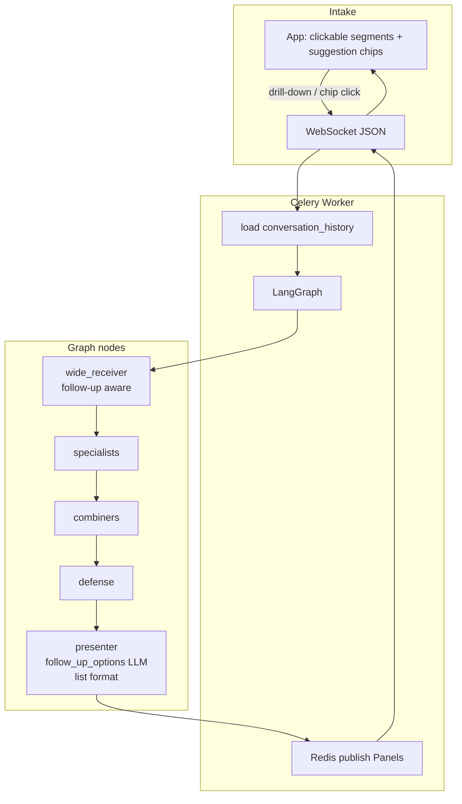

# TESS Engine — Phase 19 Session Opening Message

## Context

Phases 1–18 are complete. The live graph runs **POV agents**, **curator/editor combiners**, **defense**, **presenter**, **product modes** (Research / Planner / Coding / Builder), **chain profiles** (L0–L4 depth gates), and a **status wall + results wall** with structured **POV segments** on multi-lens completed Panels.

Architecture docs: [AI_MAP.md](AI_MAP.md), [ROADMAP.md](ROADMAP.md), [SCHEMA.md](SCHEMA.md).

**Phase 19 goal:** Make results **interactive** — drill-down on segment titles, LLM-generated follow-up suggestions (context-related and adjacent), structured list formats, and **choice themes** (four steer options) — replacing static mock follow-up buttons.

| Phase 18 baseline (reuse) | Phase 19 adds |
|---------------------------|---------------|
| `pov_segments` with titled blocks + POV badges | **Clickable segment titles** → auto-send drill-down in context |
| Static `follow_up_options` (`Continue with this`, …) | **LLM-generated** `follow_up_options` on completed Panels |
| Flat markdown `content` for single-lens runs | **Structured list formats** (top 10, ranked items) when intent matches |
| WR uses Redis `conversation_history` for follow-ups | **Context-related** clarifying questions + **adjacent-topic** suggestions |
| `PanelCard` footer buttons call `onFollowUp` → `handleSend` | **Choice themes** — four themed next-step options for user steering |
| `PanelSegments` renders `<h3>` titles (not interactive) | Segment drill-down + suggestion chips wired to same send path |

**Important:** Phase 19 improves **how users continue the conversation** after a Panel completes. It does **not** change the core LangGraph topology (that is Phase 20 streaming / interruption). Follow-up messages still travel the same WebSocket → Celery → graph path; enrichment is in presenter/WR prompts and frontend affordances.

### Phase 18 baseline (shipped)

| Area | Status |
|------|--------|
| Status wall | [`StatusWall.tsx`](frontend/src/components/StatusWall.tsx) + [`usePipelineStatus.ts`](frontend/src/hooks/usePipelineStatus.ts) — reads `pipeline_stage` from in-flight Panels |
| Folder tree | [`FolderTree.tsx`](frontend/src/components/FolderTree.tsx) — virtual tree from [`app/core/folder_tree.py`](app/core/folder_tree.py) |
| Results wall | [`ResultsWall.tsx`](frontend/src/components/ResultsWall.tsx) — filters Panels by `folder_path` |
| POV segments | [`PanelSegments.tsx`](frontend/src/components/PanelSegments.tsx) — structured blocks when `pov_segments.length > 0` |
| Segment builder | [`app/graph/pov_segments.py`](app/graph/pov_segments.py) — `build_pov_segments()` with mayor_data fallback |
| Pipeline stages | [`app/graph/pipeline_stages.py`](app/graph/pipeline_stages.py) — `routing` → `agents` → `combining` → `defense` → `presenting` → `done` |
| Panel schema | `pipeline_stage`, `pov_segments` / `PanelSegment` on [`Panel`](app/graph/schemas.py) |
| Follow-up buttons | [`PanelCard`](frontend/src/components/PanelCard.tsx) footer — static [`DEFAULT_FOLLOW_UP_OPTIONS`](app/graph/schemas.py) from presenter |
| Conversation memory | Redis history via [`app/core/conversation.py`](app/core/conversation.py); WR prompt already mentions "tell me more about …" |
| Tests | **76 total** — `test_pov_routing` (13), `test_combiner_utils` (7), `test_product_modes` (17), `test_chain_profiles` (24), `test_pipeline_stages` (6), `test_pov_segments` (9) |
| Canonical multi-POV | *"Design a science app UI covering aesthetics and usability"* at `L4` → `art` + `ui_design` → combiners → defense → `pov_segments` for Art + UI Design |

### Phase 18 session fixes (baseline — already in codebase)

These shipped during Phase 18 polish; treat as regression guards for Phase 19 work on segments and follow-ups.

| Fix | Behavior | Key code |
|-----|----------|----------|
| **Mayor_data fallback** | When L4 combiner merges multi-POV into one thematic `usable_answer`, or thematic segments don't cover ≥2 routed POVs, builder falls back to per-specialist `mayor_data` segments | `_segments_cover_multiple_povs`, `_segments_from_mayor_data` in [`pov_segments.py`](app/graph/pov_segments.py) |
| **Single-lens regression** | Researcher with multiple thematic `usable_answers` (e.g. 5 cybersecurity themes) must **not** render duplicate POV blocks — flat `content` only | `_is_single_lens_run`, `_segments_share_single_lens` |
| **Search + researcher L4** | `researcher` + `resource_reader` runs combiners; multiple `usable_answers` are correct as flat markdown — **no** `pov_segments` (single specialist lens) | `_count_specialists` excludes `resource_reader`; `_is_single_lens_run` returns `[]` |

### Known limits (Phase 18)

- **Segment titles are not clickable** — drill-down requires manual typing in `MessageInput`.
- **Static follow-up buttons** — presenter always emits `DEFAULT_FOLLOW_UP_OPTIONS`; not tailored to Panel content or user intent.
- **No structured list UI** — "top 10 beaches" renders as prose/markdown only; no ranked-list template or presenter hint.
- **No choice themes** — no four-option steer UI beyond generic follow-up chips.
- **POV segment edge cases** — combiner may produce multiple thematic segments under one POV; builder falls back to `mayor_data` when segments don't reflect ≥2 routed lenses. Single-lens paths (coder, researcher, researcher+search) intentionally omit `pov_segments`.
- **Session-scoped** — drill-down context uses Redis conversation history per session; no cross-session Panel memory.
- **Formatting polish ongoing** — segment layout and status wall multi-compare UX may still need visual refinement; Phase 19 focuses on interaction, not a full design pass.

---

## Production

| Item | Value |
|------|-------|
| URL | http://5.78.186.223 (HTTP/IP mode) |
| Repo | https://github.com/sykis17/tess.git |
| Server path | `/opt/tess-engine` — deploy with `git pull && ./deploy/deploy.sh` |
| Local | Docker Compose + Ollama on Windows host; frontend `npm run dev` |
| Tests | `pytest tests/test_pov_routing.py tests/test_combiner_utils.py tests/test_product_modes.py tests/test_chain_profiles.py tests/test_pipeline_stages.py tests/test_pov_segments.py` |

---

## Goal for Phase 19: Interactive learning UX

Turn completed Panels into **conversation starters** — users explore deeper, clarify intent, or branch to adjacent topics without crafting prompts from scratch.

### Six deliverables

| # | Feature | User experience |
|---|---------|-----------------|
| 1 | **Click title → drill down** | Clicking a `pov_segments` title (or main Panel heading) auto-sends e.g. *"Tell me more about [title]"* with session context |
| 2 | **Context-related questions** | WR or presenter suggests 1–2 clarifying follow-ups tied to the current answer (accuracy, scope, audience) |
| 3 | **Context-deviating questions** | Adjacent-topic suggestions broaden exploration without leaving the session |
| 4 | **Structured list formats** | Prompts like *"10 best beaches"* or *"top careers in AI"* produce ranked/itemized output (presenter + optional UI) |
| 5 | **Choice themes** | Four themed next-step options (e.g. depth, angle, format, action) for user steering |
| 6 | **LLM `follow_up_options`** | Replace static `DEFAULT_FOLLOW_UP_OPTIONS` with model-generated chips on completed Panels |

### Follow-up taxonomy

| Type | Purpose | Example |
|------|---------|---------|
| **Drill-down** | Expand one segment or section | *"Tell me more about Usability patterns"* |
| **Context-related** | Clarify user need within topic | *"Who is the target audience for this app?"* |
| **Context-deviating** | Adjacent exploration | *"How would this compare to a gaming app UI?"* |
| **Choice theme** | Steer next step among four paths | *"Go deeper on accessibility" / "Add a color palette" / "Sketch wireframes" / "Compare to Material Design"* |
| **List format** | Structured enumeration | Numbered top-N, ranked careers, checklist items |

### Static follow-ups today (to replace)

```python
# app/graph/schemas.py
DEFAULT_FOLLOW_UP_OPTIONS = [
    "Continue with this",
    "Change style",
    "Discard",
]
```

Presenter copies these on every completed Panel. Phase 19 should generate 3–4 contextual options (mix of related + deviating + choice themes) while keeping backward-compatible fallbacks when LLM generation fails.

---

## Design choices / architecture

### Drill-down flow (target)

```
User clicks segment title in PanelSegments
  → frontend builds: "Tell me more about {title}" (+ optional segment_id / panel_id metadata)
  → same WebSocket send path as MessageInput / follow-up buttons
  → worker loads conversation_history (includes prior answer)
  → WR interprets as follow-up; routes specialists as needed
  → new Panel streams with pipeline_stage progression
```

**Frontend:** Add `onSegmentClick(title: string, segment?: PanelSegment)` to [`PanelSegments`](frontend/src/components/PanelSegments.tsx); thread through [`PanelCard`](frontend/src/components/PanelCard.tsx) → [`ResultsWall`](frontend/src/components/ResultsWall.tsx) → [`App.tsx`](frontend/src/App.tsx) `handleSend`. Style titles as buttons/links (`cursor: pointer`, focus ring).

**Optional enrichment:** Include segment `content` excerpt or `source_agents` in a hidden context block for WR — v1 can rely on Redis conversation history if presenter appends the completed answer (already happens via `append_conversation_turn` in worker).

### LLM-generated `follow_up_options`

**Backend (recommended):** Extend **presenter** (or a small `follow_up_generator` helper) to call LLM once after content is finalized:

```python
class FollowUpSuggestion(BaseModel):
    label: str           # short chip text (≤ ~40 chars)
    kind: Literal["related", "deviating", "choice", "drill_down"]
    prompt: str | None   # full text to send when clicked; defaults to label
```

Map to existing `follow_up_options: list[str]` for backward compatibility (chip `label` only), **or** add optional `follow_up_metadata` on Panel if full `prompt` differs from label — prefer extending schema only if needed.

**Prompt sketch:** Given completed `content`, `pov_segments`, `product_mode`, and `active_agents`, return exactly 4 suggestions: 2 context-related, 1 adjacent/deviating, 1 choice-theme cluster — all actionable as user messages.

**Fallback:** On LLM failure or timeout, use trimmed `DEFAULT_FOLLOW_UP_OPTIONS` plus one drill-down derived from first segment title.

### Structured list formats

**Detection:** WR or presenter recognizes list intent (regex + LLM): *"top N"*, *"best X"*, *"list of"*, *"ranked"*.

**Output:** Presenter formats `content` with numbered markdown list or a new optional `content_format: "ranked_list" | "markdown"` field. Frontend [`PanelContent`](frontend/src/components/PanelContent.tsx) can render ordered lists with stronger typography when format is set.

**Combiner hint:** For L4 multi-POV list prompts, combiner micro may still merge — list format applies to final presenter output, not per-segment POV blocks.

### Choice themes (four options)

Present **four** steer buttons after complex answers — distinct from generic follow-ups:

| Slot | Intent |
|------|--------|
| 1 | Go deeper (detail) |
| 2 | Change angle (POV or subtopic) |
| 3 | Change format (list, plan, comparison) |
| 4 | Practical next step (build, implement, summarize) |

Can overlap with `follow_up_options` if the presenter returns exactly four themed chips. UI: reuse footer button row; optional visual grouping (related vs deviating) via CSS classes.

### Layout (unchanged shell, richer Panel footer)

```
┌─────────────────────────────────────────────────────────────┐
│ StatusWall (Phase 18)                                       │
├──────────────┬──────────────────────────────────────────────┤
│ FolderTree   │ ResultsWall                                  │
│              │  PanelCard                                   │
│              │    PanelSegments ← clickable titles          │
│              │    [related] [related] [adjacent] [choice]   │
├──────────────┴──────────────────────────────────────────────┤
│ MessageInput                                                │
└─────────────────────────────────────────────────────────────┘
```

---

## Target data flow



### Panel extension (Phase 19 — optional fields)

```python
# Minimal v1: keep follow_up_options as list[str] (LLM-generated labels)
# Optional v2:
content_format: str | None = None  # "markdown" | "ranked_list"
follow_up_kinds: list[str] = []    # parallel to follow_up_options: related | deviating | choice
```

Prefer **no new required fields** — empty `follow_up_options` falls back to defaults; missing `content_format` renders as markdown.

---

## Code touchpoints (before Phase 19)

### PanelSegments — titles not interactive

```17:21:frontend/src/components/PanelSegments.tsx
          <header className="panel-segments__header">
            <h3 className="panel-segments__title">{segment.title}</h3>
            {segment.pov && (
              <span className="panel-segments__pov-badge">{segment.pov}</span>
```

**After Phase 19:** Wrap title in `<button>` or add `onClick`; call `onSegmentClick(segment.title, segment)`.

### PanelCard — static follow-up footer

```146:158:frontend/src/components/PanelCard.tsx
      {!isProcessing && isCompleted && followUpOptions.length > 0 && (
        <footer className="panel-card__footer">
          {followUpOptions.map((option) => (
            <button
              key={option}
              type="button"
              className="panel-card__follow-up"
              onClick={() => onFollowUp(option)}
            >
              {option}
            </button>
          ))}
```

**After Phase 19:** Optional chip styling by kind; send `prompt` if metadata exists. Keep `onFollowUp` contract.

### Presenter — static follow-ups

```191:191:app/graph/nodes/presenter.py
        follow_up_options=list(DEFAULT_FOLLOW_UP_OPTIONS),
```

**After Phase 19:** Call `generate_follow_up_options(content, pov_segments, product_mode, active_agents)` with fallback to defaults.

### WR prompt — follow-up aware but no suggestions

[`app/graph/prompts.py`](app/graph/prompts.py) mentions interpreting *"tell me more about …"* from history. Phase 19 adds explicit suggestion generation post-presenter (not WR-only) unless product decision splits WR clarifying questions on **next** message intake.

### App — single send path (reuse)

```56:69:frontend/src/App.tsx
  const handleSend = (text: string) => {
    if (compareEnabled && compareLevels.length >= 2) {
      ...
    }
    ...
    sendMessage(text, selectedMode, profile);
  };
```

Drill-down and chips should call `handleSend` with constructed text — no new transport.

---

## What's working (Phase 18 baseline to reuse)

| Concept | Behavior |
|---------|----------|
| **`pov_segments`** | Multi-POV L4 Panels show per-lens blocks; single-lens uses flat `content` |
| **`build_pov_segments`** | Mayor fallback, single-lens guard — do not break when adding presenter follow-up LLM |
| **`follow_up_options` on Panel** | Schema + frontend already wire chips → send |
| **Conversation history** | Worker appends user + assistant turns; WR sees prior answer |
| **Status wall + folder filter** | Unchanged; new interactions live inside `PanelCard` / `PanelSegments` |
| **Compare mode** | Multiple Panels — each gets its own generated follow-ups |
| **Celery budget** | Follow-up LLM call in presenter adds ~1 call per completed Panel — stay within 720s soft limit |

---

## Deliverables checklist

| # | Area | Work |
|---|------|------|
| 1 | **Drill-down UI** | Clickable segment titles; `onSegmentClick` → `handleSend("Tell me more about …")` |
| 2 | **Follow-up generator** | `app/graph/follow_up_utils.py` (or presenter helper) — LLM JSON for 3–4 suggestions |
| 3 | **Presenter** | Replace static `DEFAULT_FOLLOW_UP_OPTIONS` with generated list + fallback |
| 4 | **List format** | WR and/or presenter detects list intent; formats numbered output; optional `content_format` |
| 5 | **Choice themes** | Ensure 4 steer options in generator prompt; document slot semantics |
| 6 | **Frontend types** | Extend [`frontend/src/types/panel.ts`](frontend/src/types/panel.ts) if metadata added |
| 7 | **PanelCard / PanelSegments** | Clickable titles; optional chip kind styling |
| 8 | **WR prompt** | Strengthen follow-up + list-intent routing hints (optional clarifying question on ambiguous drill-down) |
| 9 | **Tests** | `tests/test_follow_up_options.py`, `tests/test_list_format.py`; extend `test_pov_segments` regression |
| 10 | **Docs** | Update `AI_MAP.md`, `SCHEMA.md`, `ROADMAP.md`; mark Phase 19 complete |

---

## Implementation order

1. [`app/graph/follow_up_utils.py`](app/graph/follow_up_utils.py) — Pydantic models + `generate_follow_up_options()` with mock/LLM path
2. [`app/graph/nodes/presenter.py`](app/graph/nodes/presenter.py) — integrate generator; fallback to `DEFAULT_FOLLOW_UP_OPTIONS`
3. List-format detection + markdown template in presenter (and WR hint if needed)
4. [`frontend/src/components/PanelSegments.tsx`](frontend/src/components/PanelSegments.tsx) — clickable titles + callback props
5. [`frontend/src/components/PanelCard.tsx`](frontend/src/components/PanelCard.tsx) — thread `onSegmentClick`; footer chip polish
6. [`frontend/src/components/ResultsWall.tsx`](frontend/src/components/ResultsWall.tsx) + [`App.tsx`](frontend/src/App.tsx) — wire drill-down to `handleSend`
7. [`tests/test_follow_up_options.py`](tests/test_follow_up_options.py) — generator fallback, presenter emits non-default options
8. [`tests/test_list_format.py`](tests/test_list_format.py) — top-N markdown structure
9. Regression: [`tests/test_pov_segments.py`](tests/test_pov_segments.py) — all 9 tests green
10. Docs + deploy

---

## Implementation notes

### Drill-down message template

```typescript
function buildDrillDownMessage(title: string): string {
  return `Tell me more about ${title}`;
}
```

For Panels without `pov_segments`, optional click on first `##` heading in `content` is out of scope v1 — segment drill-down only when `pov_segments.length > 0`.

### Follow-up generator (sketch)

```python
async def generate_follow_up_options(
    content: str,
    pov_segments: list[PanelSegment],
    product_mode: str | None,
    active_agents: list[str],
) -> list[str]:
    """Return 3–4 short chip labels; fallback to DEFAULT_FOLLOW_UP_OPTIONS on error."""
    ...
```

Run in presenter via existing async LLM wrapper; cap tokens low (fast model). **Do not block** Panel publish on slow LLM — v1 may emit Panel with defaults first then patch (optional v2); prefer single presenter call before publish to avoid WS churn.

### List format (presenter sketch)

```python
def format_as_ranked_list(items: list[str], title: str) -> str:
    lines = [f"## {title}", ""]
    for i, item in enumerate(items, 1):
        lines.append(f"{i}. {item}")
    return "\n".join(lines)
```

Detection can live in WR `current_task` summary or presenter post-processing of `usable_answers`.

### Phase 18 regression guards

When touching presenter output, preserve:

- `build_pov_segments()` rules in [`pov_segments.py`](app/graph/pov_segments.py) — especially `_is_single_lens_run` and mayor_data fallback
- Search + researcher: `active_agents = ["researcher"]` + `resource_reader` in `mayor_data` → `pov_segments == []`
- Multi art + ui_design merged combiner output → 2 mayor_data segments

---

## Test matrix (Phase 19)

| Scenario | Input | Expect |
|----------|-------|--------|
| Drill-down click | Click segment title *"Usability patterns"* | WebSocket sends *"Tell me more about Usability patterns"*; new Panel completes |
| Generated follow-ups | Any completed L4 Panel | `follow_up_options` ≠ static defaults (when LLM mocked in test) |
| Follow-up fallback | LLM generator raises | `follow_up_options` == `DEFAULT_FOLLOW_UP_OPTIONS` |
| Context-related chip | Click a related suggestion | New message uses chip text; WR routes with history |
| List format | *"What are the top 5 careers in cybersecurity?"* | `content` contains numbered 1–5 list |
| Choice themes | Complex multi-segment answer | 4 footer chips with distinct steer intents |
| Single-lens regression | Researcher L4 with 5 thematic segments | `pov_segments` empty; flat content; follow-ups still generated |
| Multi-POV regression | Canonical UI design prompt | `pov_segments` ≥ 2; clickable titles; follow-ups reference lenses |
| Search + researcher | L4 factual + search | No `pov_segments`; list or prose follow-ups OK |
| Backward compat | Panel JSON without new optional fields | UI renders; static defaults if empty `follow_up_options` |
| Regression | Phase 18 tests | All 76 existing tests green |

```bash
pytest tests/test_pov_routing.py tests/test_combiner_utils.py tests/test_product_modes.py tests/test_chain_profiles.py tests/test_pipeline_stages.py tests/test_pov_segments.py
pytest tests/test_follow_up_options.py tests/test_list_format.py
```

---

## Out of scope for Phase 19 (future phases)

| Phase | Feature |
|-------|---------|
| **20** | Token streaming; `interruption_flag` mid-chain steer |
| Post-19 | Cross-session Panel memory; bookmarked drill-down threads |
| Post-19 | Inline expand segment without new graph run (client-only) |
| Post-19 | User-editable follow-up chips before send |

---

## Constraints

- Follow `.cursorrules` (async, Pydantic, Celery for heavy work, modular structure).
- **Backward compatible:** `follow_up_options` remains `list[str]`; new Panel fields optional.
- Drill-down and chips use **existing** WebSocket send — no new message type in v1.
- English for user-facing text, generated suggestions, and code comments.
- Do not regress Phase 18 `pov_segments` builder, status wall, folder filter, or Phase 17 chain gates.
- Extra presenter LLM call must respect Celery **720s** soft limit — keep follow-up generation concise.
- Never return `{}` from graph nodes.

---

## Key files (Phase 18 baseline)

| Area | Path |
|------|------|
| Graph | [`app/graph/builder.py`](app/graph/builder.py) |
| Presenter | [`app/graph/nodes/presenter.py`](app/graph/nodes/presenter.py) |
| POV segments | [`app/graph/pov_segments.py`](app/graph/pov_segments.py) |
| WR | [`app/graph/nodes/wide_receiver.py`](app/graph/nodes/wide_receiver.py) |
| Schemas | [`app/graph/schemas.py`](app/graph/schemas.py), [`SCHEMA.md`](SCHEMA.md) |
| Conversation | [`app/core/conversation.py`](app/core/conversation.py) |
| Worker / WS | [`app/worker.py`](app/worker.py), [`app/api/ws.py`](app/api/ws.py) |
| Frontend shell | [`frontend/src/App.tsx`](frontend/src/App.tsx) |
| Panel UI | [`frontend/src/components/PanelCard.tsx`](frontend/src/components/PanelCard.tsx), [`PanelSegments.tsx`](frontend/src/components/PanelSegments.tsx) |
| Results wall | [`frontend/src/components/ResultsWall.tsx`](frontend/src/components/ResultsWall.tsx) |

**New files (expected):**

| Area | Path |
|------|------|
| Follow-up generator | `app/graph/follow_up_utils.py` |
| Tests | `tests/test_follow_up_options.py`, `tests/test_list_format.py` |

---

## Try it / Verify locally

**Baseline (must stay green before and after Phase 19):**

```bash
pytest tests/test_pov_routing.py tests/test_combiner_utils.py tests/test_product_modes.py tests/test_chain_profiles.py tests/test_pipeline_stages.py tests/test_pov_segments.py
```

**After Phase 19:**

```bash
pytest tests/test_follow_up_options.py tests/test_list_format.py
docker compose restart worker
cd frontend && npm run dev
```

| Check | Action | Expect |
|-------|--------|--------|
| Drill-down | Complete multi-POV Panel; click segment title | New user message sent; follow-up Panel streams |
| Follow-up chips | Complete any Panel | Footer shows contextual options (not only Continue/Change/Discard) |
| List prompt | *"Top 10 beaches in Greece"* | Numbered list in completed `content` |
| Choice steer | Click a choice-theme chip | New Panel addresses selected angle |
| Single-lens | Researcher-only L4 answer | No POV blocks; drill-down N/A; chips still work |
| Phase 18 UI | Status wall + folder filter | Unchanged behavior |
| Regression | Canonical L4 UI prompt | `pov_segments` for Art + UI Design; clickable titles |

---

## Docs update checklist (when Phase 19 ships)

| Doc | Change |
|-----|--------|
| [AI_MAP.md](AI_MAP.md) | Document interactive follow-ups + drill-down as **live** |
| [SCHEMA.md](SCHEMA.md) | `follow_up_options` generation; optional `content_format` |
| [ROADMAP.md](ROADMAP.md) | Check off Phase 19; move Phase 20 to "Next" |
| [README.md](README.md) | Update current graph line to Phase 19 |

---

## Request

Please review [AI_MAP.md](AI_MAP.md) (current chain), [SCHEMA.md](SCHEMA.md) (`follow_up_options`), and [ROADMAP.md](ROADMAP.md) (Phase 19 scope) before starting.

**Goal:** Implement Phase 19 — clickable segment drill-down, LLM-generated `follow_up_options` (context-related, adjacent, choice themes), structured list formats, tests, docs, commit + deploy.

**Start command for a new chat:**

> Implement Phase 19 per PHASE_19_OPENER.md

---

## Glossary

| Term | Meaning |
|------|---------|
| Drill-down | User clicks a segment title to auto-send *"tell me more about …"* |
| Context-related question | Follow-up suggestion that clarifies or deepens the current topic |
| Context-deviating question | Adjacent-topic suggestion that broadens exploration |
| Choice theme | One of four steer options shaping the next answer's angle or format |
| `follow_up_options` | Short chip labels on completed Panels; clicking sends as user message |
| Structured list format | Ranked or numbered output (top N, best X) vs free-form prose |
| `pov_segments` | Phase 18 per-lens blocks — drill-down targets segment `title` |
| Single-lens run | One specialist (+ optional search) — flat `content`, no `pov_segments` |
