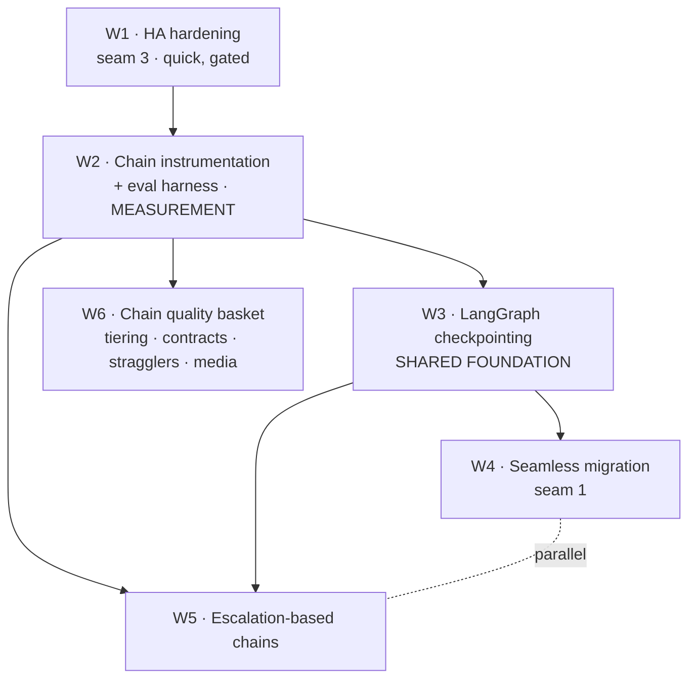

# TESS Engine — Next-Steps Program Plan

Authored 2026-07-26, immediately after the CP-HA Quorum Fence Store arc merged to `main`
(`44645c2`, PR #10 → merge `48924d6`). **Active plan** — landed on main as a docs-only
commit. Six workstreams, sequenced by dependency, each scoped to **seed its own opener**
when a fresh session starts it. Coding happens in per-workstream sessions; this doc is the map.

Sources of truth this plan builds on: [AI_MAP.md](../AI_MAP.md) (graph architecture),
[CLAUDE.md](../CLAUDE.md) (invariants), [deploy/MULTI_CLOUD.md](../deploy/MULTI_CLOUD.md)
(ops/HA + §Deferred hardening), [ROADMAP.md](../ROADMAP.md).

---

## Guiding principles

1. **Measure before you optimize.** The ops layer earned its improvements through a
   harness + metrics; the graph has *none* (`app/graph` has zero OTel calls today). Do not
   "streamline" a system you can't measure — build the measurement first (**W2**).
2. **Translate the arc's discipline to the AI layer.** Every chain change lands behind a
   gate that would **fail without it** (non-vacuous evidence), same rule the split-brain
   harness enforced.
3. **Two shared foundations unlock most of the downstream work:** instrumentation +
   eval (**W2**) and run checkpointing (**W3**). Build them once; migration *and* chain
   work both draw on them.
4. **A registered-but-barely-exercised path is where bugs live rent-free** (the arc's
   recurring lesson). Media agents (seam 2) get invested in or explicitly gated — not left
   half-alive.

---

## Sequencing

**Order to execute:** W1 → W2 → W3 → then **W4 and W5 fork in parallel** (both depend
only on their shared ground). W6 items slot in individually any time after W2.

**Hard vs soft dependencies.** A diagram arrow can mean either, so read them explicitly:
**W5 hard-depends on W2** (escalation is unmeasurable — therefore unlandable — without the
eval gate) but only **soft-depends on W3** (checkpointing eases W5's iterate/replay loop; it
is not a prerequisite). **W4 hard-depends on W3.** Where a per-section *depends-on* line and
the diagram seem to differ, the section line names the **hard** dependency.

**Big-picture north star** (see end of doc): W2's eval data + the ops plane's existing
scoring/failover converge into *one* idea — an engine that routes **both infrastructure and
intelligence by measured performance**.

---

## W1 — HA hardening (seam 3)  ·  *quick, do first, still gated*  ·  ✅ **DONE**

> **Opener written:** [W1_HA_HARDENING_OPENER.md](W1_HA_HARDENING_OPENER.md) — the
> cold-start execution doc (per-commit gates + verification). This section is the summary.

> **DONE (2026-07-26, branch `ops/w1-ha-hardening`).** Three gated commits: rename
> `promote_redis_fence` → `promote_fence` (+ span; unit 279/2, fencing 8/8, live-etcd parity
> 4/4, dev split-brain 11/11 @etcd + s11 @redis); hash-pinned `requirements.lock.txt`
> (pinned to the verified image's freeze — lock≡freeze 103/103, zero drift;
> `--require-hashes` in the Dockerfile, bad-hash aborts proven); non-root containers
> (`USER appuser` uid 1000; `whoami ≠ root` verified; harness gates re-run non-root).
> **Found along the way:** the offline verifier's split-brain step has been broken since the
> Step-3 topology change → diagnosed (s01–s10 pass 10/10 single-node; s11 quorum-only) and
> filed as **W1.5** below — the one W1 acceptance item it displaces (offline *failover*
> certification) rides on W1.5, not W1.

**Goal.** Clear the two deferred hardening items + the cosmetic rename so the deploy
surface is clean before migration work (W4) touches it.

**Why first.** Small, self-contained, and it hardens the exact surface W4 will modify.
The lockfile also makes the Sovereignty Audit reproducible rather than point-in-time.

**Scope (three commits):**
1. **Non-root containers.** `Dockerfile` is `python:3.11-slim` with **no `USER`** (runs as
   root). Add a non-root user, `chown` the app + any writable dirs, `USER` before CMD.
   Check `frontend/Dockerfile` too. Watch: etcd/redis volume perms and the **in-container
   split-brain runner** must still work non-root.
2. **Hash-pinned lockfile.** `requirements.txt` has **no hashes**. Generate
   `requirements.lock.txt` with `--hash` (pip-compile or `pip freeze` + hashes); install
   from it in `Dockerfile` and the offline bundle. This is what makes
   `deploy/offline/` reproducible.
3. **Rename `promote_redis_fence` → `promote_fence`** (authority-agnostic post-cutover).
   Blast radius is known: `app/ops/store.py`, `app/main.py`, **`tests/test_ops_fencing.py`
   (grep-guard)**, + 7 docs. **Update the guard in the same commit** — same rule the arc
   used for banned symbols.

**Gates.** These touch the ops/HA + container surface, so the arc's gate rule applies:
- Rename touches the `store.py` FenceStore path → **unit + `tests/test_ops_fencing.py` +
  live-etcd parity + split-brain `run-all` 11/11** (per CLAUDE.md invariant).
- Non-root changes the container the harness runs in → **re-run `run-all` 11/11** (proves
  non-root didn't break etcd perms / the in-container runner).
- Lockfile → **offline `build-bundle.sh` → `install-offline.sh` →
  `verify-egress-blocked.sh` green**; unit suite green.
- Doc-links checker 0 broken (rename edits docs).

**Acceptance.** All three landed; `docker exec <web> whoami` ≠ root; the lock installs
with hash verification; `grep -r promote_redis_fence` returns only historical archive docs
(or zero). MULTI_CLOUD.md §Deferred hardening updated to "done."

**Size.** ~1 focused session.

**Decision (SETTLED).** Lockfile tool = **pip-tools** (`pip-compile --generate-hashes`).
The tool is **dev-time only** — the install path in the `Dockerfile` and offline bundle
stays plain `pip install --require-hashes -r requirements.lock.txt`, so **no new binary
enters the zero-network boundary**. That keeps it low-stakes: pip-tools is the boring-mature
pick, and swapping to `uv pip compile` later is a one-line compile-step change that never
touches the bundle.

---

## W1.5 — Offline-verifier topology re-sync  ·  *prioritized follow-up, do right after W1*  ·  ✅ **DONE**

> **Opener written:** [W1_5_OFFLINE_VERIFIER_OPENER.md](W1_5_OFFLINE_VERIFIER_OPENER.md) —
> the cold-start execution doc (measured diagnosis inlined, per-step gates, exact runner
> commands, laptop timing profile). This section is the filing; start sessions there.

> **DONE (2026-07-26, branch `ops/w1.5-offline-verifier`).** Three gated commits: (1) env
> plumbing — the verifier's runner sets `OPS_HA_ETCD_SERVICES=etcd` + a 6×lease-TTL
> convergence budget (TTL passed through so harness deadlines derive from the same value) —
> plus topology-keyed `s11` gating (`skip_reason(cfg)`: <3 etcd members → explicit
> SKIP-with-reason before any docker call; 3-node executes unchanged, unit-proven); (2) the
> expected tally enforced **in-harness** as an exit-code artifact (`run-all --expect-pass 10
> --expect-skip 1` offline / `--expect-pass 11 --expect-skip 0` dev), every live stale
> "10/10" site killed (both verifier hints, the **attestation**, and `CLAUDE.md`'s offline
> paragraph), and the MULTI_CLOUD **Known gap** block replaced by the restored
> failover-certification claim; (3) `reset_stack` falls through to a full `compose up` when
> a torn-down project leaves `worker`/`otel-collector` uncreated. Verified: offline chain
> `build-bundle → install-offline → verify-egress-blocked` exit 0 end-to-end (10 PASS +
> 1 topology-SKIP); env-line-removed repro still 0-at-setup (non-vacuity); dev `run-all`
> 11/11 with `s11` executed from a torn-down start (proving both the dev regression gate and
> the reset_stack fix).

> **W2-era follow-ups filed by W1.5:** (1) **s11 single-node variant** — turn the topology
> skip into an assertion (sole etcd down → sustained 503s, durable writes resume after etcd
> restart); (2) archive `CP_HA_ENGINEERING_REPORT.md` under `docs/archive/ops/` (dated arc
> snapshot whose pre-s11 "10/10" prose predates the 11-scenario suite).

**Why this exists.** Running W1's Commit 2 offline gate surfaced that the offline verifier's
split-brain step has been **broken on `main` since the Step-3 3-node-etcd cutover** — the
arc's own recurring failure mode (a non-default verification path silently rotting) biting
the arc itself within a week, because the offline verifier was never added to the per-step
gate ladder after the topology changed under it. This is a **certification gap on a product
surface**: since Step 3, no offline bundle has passed its own *full* verifier, so sovereign
deploys are **deploy- and egress-certified but not failover-certified**, and the Sovereignty
Audit's "run-all 10/10" claim is stale.

**Diagnosis (measured 2026-07-26, single-node offline stack).** The offline stack ships a
single `etcd` service; the harness defaults to `etcd-1,etcd-2,etcd-3` and
`verify-egress-blocked.sh` never sets `OPS_HA_ETCD_SERVICES`, so every scenario dies at setup
on `docker compose ps -q etcd-1` (0/11). With `OPS_HA_ETCD_SERVICES=etcd` the
single-node-applicable subset **s01–s10 passes 10/10**; **only `s11`** (kill a Raft leader
mid-storm, expects re-election on a surviving quorum member) is inapplicable to single-node
and fails with sustained 503s. `s06_etcd_down` needs **no** gating — on single-node "etcd
down" = total loss = the sitting primary correctly demotes.

**Scope (the fix is not one line):**
1. **Env plumbing:** `verify-egress-blocked.sh` passes `OPS_HA_ETCD_SERVICES=etcd` to the
   in-container runner (matches the offline stack's actual service name).
2. **Topology-aware scenario gating:** mark `s11` (and any future quorum-only scenario) as
   requiring ≥3 etcd nodes; the offline single-node run skips it — or a single-node variant
   asserts the correct "no survivor → writes stay blocked" behavior instead of re-election.
3. **Re-baseline the verifier's expected tally** (10/10 applicable, `s11` explicitly skipped)
   and **kill the stale "10/10" hint text** in `install-offline.sh`.
4. **Refresh the Sovereignty Audit** claim in `deploy/MULTI_CLOUD.md` §Offline once green.

**Gate / non-vacuity.** `verify-egress-blocked.sh` green end-to-end on the offline bundle
(structural + egress + smoke + the gated split-brain subset). The gating must be
**topology-keyed** — a real 3-node run still runs `s11` — not a blanket skip that would make
`s11` vacuous everywhere.

**Two more findings from W1's Commit-3 run (fold into this fix):**
- **Convergence budget is VM-sized.** On a memory-capped WSL2 VM (~4 GB), the etcd-fault
  recovery scenarios (s03/s06/s07/s09) converge in ~35–60 s — past the harness default
  `3 × lease_TTL = 30 s` — and time out with `durable[etcd] fence+blob after election`
  (they pass cleanly at `OPS_HA_CONVERGENCE_TIMEOUT=60`; same runs, no permission errors,
  s08's identical durable path green at 30 s — measured non-root, 2026-07-26). The offline
  verifier should set/document a realistic convergence budget rather than inherit the
  dev-tuned default.
- **`reset_stack` assumes a pre-existing full stack.** It recreates only CP + etcd (+ redis
  start) with `--no-deps`; from a torn-down project it silently yields a stack with **no
  worker / otel-collector**, and `s10` then fails on worker-metrics reachability. Either
  `reset_stack` grows a first-run full `compose up`, or the runbooks state "bring the full
  stack up once before `run-all`."

**Durable cure (W2).** The offline chain joins the **nightly CI tier** (see Cross-cutting —
CI) so this non-default path can't rot invisibly again — the exact discipline the arc used
for its four manual gates.

**Size.** ~1 short session.

---

## W2 — Chain instrumentation + eval harness  ·  *the measurement foundation*

> **Handoff notes written:** [W2_HANDOFF_NOTES.md](W2_HANDOFF_NOTES.md) — session-local
> environment profile, measured gate runtimes, and the W1.5 tooling CI will lean on
> (`--expect` tally flags, cold-start `run-all`, size ceiling). Fold into the W2 opener at
> session start, after settling the open decisions below.

**Goal.** Give the graph what the ops plane already has: per-node observability + a
repeatable eval gate. Nothing downstream (W5, W6) is verifiable without this.

**Scope:**
- **Per-node spans/metrics.** Extend the existing ops OTel
  (`app/ops/metrics.py::get_tracer`) into the graph. Per node per run: **tokens
  (prompt/completion), latency, cost, model, agent, chain_profile, product_mode**. Persist
  via the `otel-collector` already in `docker-compose.ops-obs.yml`.
  - **Respect the cardinality discipline** from `app/ops/metrics.py`: `session_id` is a
    **span attribute, never a metric label** (it's unbounded); metric labels stay a fixed
    enum (agent name, node, model, chain_profile). `tess_graph_` prefix, allowlisted labels.
  - Cost needs a token→price map per model (small config).
  - **Metrics-guard twin (required).** Add `tests/test_graph_metrics.py` mirroring
    `tests/test_ops_metrics.py`: enforce the `tess_graph_` label allowlist, ban unbounded
    labels (`session_id` / url / error-string), assert the prefix, and assert `record_*`
    never raises. Without this test the cardinality discipline is a comment, not a gate.
- **Eval harness** — `scripts/graph_eval/` (analogous to `scripts/ops_cp_splitbrain/`): a
  **golden set** of prompts, each with a rubric; scored (LLM-judge and/or deterministic
  checks); run before any chain change. Emits per-run tokens/latency/cost + a score.

**Gate / non-vacuity.** The eval harness must **catch a known regression** — e.g., force a
bad routing override and confirm the score drops. A rubric that always passes is the AI
version of a vacuous test.

**Acceptance.** `python -m scripts.graph_eval run-all` prints per-prompt scores + a
tokens/latency/cost table; a Panel/trace shows per-node spans in the collector; a
deliberately broken chain fails the eval.

**Size.** ~2 sessions (spans, then eval harness).

**Open decisions (confirm before starting):**
- **Trace/metric sink:** OTLP → collector (already present) vs Redis vs sqlite for
  persisted per-run history.
- **Eval scoring:** LLM-judge (needs a judge model + cost) vs deterministic rubrics vs
  both. Recommendation: both — deterministic checks for structure, judge for quality.
- **Golden-set source/size:** hand-authored seed (~15–25 prompts spanning L0–L4, each
  product mode, POV vs tool vs media) — enough to be a gate, small enough to run fast.

---

## W3 — LangGraph checkpointing  ·  *shared foundation*

**Goal.** Make runs **checkpointable/resumable**. Today a live run exists only in a Celery
worker's memory mid-`astream` ([builder.py:78](../app/graph/builder.py#L78) is a bare
`compile()`), so it can't be migrated, resumed after interrupt, or replayed.

**Scope.**
- `builder.compile(checkpointer=...)` with a durable checkpointer; thread runs by
  `session_id` (LangGraph `configurable.thread_id`). Redis is already in the stack — a
  Redis-backed saver is the low-friction choice.
- Reconcile with the existing reducer-merge model (`_REDUCER_KEYS` in `app/worker.py`) and
  the fan-in join (`expected_fan_in_branches`) — checkpoints must capture mid-fan-out state.
- Wire resume into `app/core/session_control.py` (interrupt already revokes the task;
  resume = re-enter from the last checkpoint).

**Payoff beyond migration.** Resume-after-interrupt, replay-for-debugging, and eval traces
— so this is not migration-only investment; W5/W6 debugging rides on it.

**Gate / non-vacuity.** A resume test: interrupt a run mid-fan-out, resume, assert the
continuation is consistent and no branch double-executes. Must fail if the checkpointer is
removed.

**Acceptance.** Kill/steer a run mid-chain → resume from checkpoint produces a coherent
final Panel; a replay reproduces the same node sequence.

**Size.** ~1–2 sessions.

**Open decisions:** checkpointer backend (Redis saver vs Postgres vs custom-over-Redis);
serialization boundaries for `GraphState` (Pydantic models + reducer lists).

---

## W4 — Seamless session migration (seam 1)  ·  *depends on W3*

**Goal.** Turn the read-only `/ops/seamless-migration` stub into: move a **live** session
between providers without dropping the WebSocket or losing Panels.

**Scope.** With W3 in place this becomes tractable: **checkpoint the run → hand `thread_id`
to the target provider → resume from checkpoint there → WS reconnect handshake** so the
frontend re-attaches to the new provider's Redis channel. Tie the trigger into the ops
plane's existing health/failover machinery (`app/ops/failover.py`, scoring).

**Gate / non-vacuity.** A migration scenario in a harness (sibling of the split-brain
harness): migrate mid-run, assert **zero Panel loss**, WS reconnects, run completes on the
new provider, and — the non-vacuity guard — prove the run actually moved (target provider
executed the tail, not the source).

**Acceptance.** A live run migrates provider→provider under load with an uninterrupted
Panel stream; documented in MULTI_CLOUD.md.

**Size.** Real arc, ~3–4 sessions.

**Open decisions:** trigger (manual `/ops` call vs health-driven auto-failover); WS
reconnect protocol; whether the Redis pub/sub channel follows the *session* or the
*provider*.

---

## W5 — Escalation-based chains  ·  *hard-depends on W2 · soft-depends on W3*

**Goal — likely the biggest single win.** Invert the depth ladder. Today depth is chosen
**up front** (`auto→L4`), so every casual query pays the full chain (fan-out, combiners,
defense, presenter). Instead: **start shallow, escalate on signal.**

**Scope.** Escalate L0/L1 → deeper on: low `wide_receiver` routing confidence, a failed
`defense_review` check, or explicit user request. The deep chain still runs — exactly when
it's needed. Reconcile with product modes (does `builder` still force L4, or become a
floor?).

**Gate / non-vacuity.** W2's eval harness proves **median latency + cost drop** while
**worst-case quality holds** — the golden set must include escalation-requiring prompts
that still reach the deep chain and still score well. Without W2 this is unmeasurable.

**Acceptance.** Eval shows a material median cost/latency reduction with no regression on
the deep-required prompts.

**Size.** ~2–3 sessions.

**Open decisions:** escalation signals + thresholds; interaction with explicit product-mode
selection; max escalation depth per turn.

---

## W6 — Chain quality basket  ·  *each lands independently after W2*

Four improvements, each small and independently gated by W2's eval + unit tests:

- **Model tiering per node.** LLM choice is a global env switch today
  (`DEFAULT_LLM_PROVIDER`). Assign models per node: `wide_receiver`=small/fast,
  specialists=mid, `defense_review`=strongest. **Bonus:** this dissolves the Ollama global
  `asyncio.Lock` bottleneck (`app/llm/ollama.py`) — under fan-out that lock serializes
  parallelism away; let local models route while cloud handles heavy nodes → real
  concurrency on small hardware. Files: `app/llm/factory.py`, `AgentConfig`, node wiring.
- **Structured contracts between nodes.** Specialists handing **prose** to combiners costs
  twice (generate + re-read) and can't be unit-tested. JSON contracts specialist→combiner
  (the FenceStore-seam idea applied to the graph): cheaper intermediates, simpler
  combiners, independently swappable/testable nodes. Files: `app/graph/schemas.py`,
  combiner nodes.
- **Straggler control in fan-out.** Parallel specialists are only as fast as the slowest.
  Per-specialist **timeouts + graceful degradation** (combine what arrived, note what
  didn't) bound tail latency. Partial results are already native to the streaming UX. Files:
  `post_fan_in.py`, the fan-in join.
- **Media-agent prune/gate (seam 2).** photo/video/audio are registered with nodes but
  barely exercised. **Invest deliberately or gate off explicitly** — don't leave them
  half-alive.

**Size.** ~0.5–1 session each.

---

## Big-picture convergence — the north star

There's a unification hiding in the architecture. The ops plane already does **health
probes, scoring, performance streaks, and failover** for cloud *providers*
(`app/ops/scoring.py`, `prober.py`, `failover.py`, `balancer.py`). Your **LLM backends
deserve the same treatment**: score models per agent-role from W2's eval data, route
accordingly, fail over when a provider degrades.

That collapses the two halves of TESS into **one idea: an engine that routes both
infrastructure and intelligence by measured performance** — and it delivers the project's
"keep up to date on the current best tools and show their performance data" promise as a
*feature*, not a doc. W2 (eval data) + the existing ops scoring/failover machinery are
exactly the two feeds it needs. Everything above is a step toward it.

---

## Cross-cutting — CI

The arc had **four manual gates** (unit suite, live-etcd parity, split-brain harness,
doc-links). As part of W2, bring them into CI and add the **eval gate**:
- Unit + doc-links: cheap, every push.
- Parity: CI service container (throwaway etcd) + `OPS_TEST_ETCD_ENDPOINT`.
- Split-brain harness + eval: Docker-in-CI, nightly or on ops/graph-path changes.
- **Offline verifier** (`build-bundle → install-offline → verify-egress-blocked`): nightly —
  **W1.5** re-synced it (topology-keyed s11 skip + in-harness expected tally) after it rotted
  invisibly precisely because it was never in the gate ladder. Nightly CI is the durable cure
  for that failure mode.
- **Eval judge budget:** the LLM-judge leg spends real tokens on every nightly run — pin a
  cheap, fixed judge model and cap the golden-set size so nightly cost stays bounded and
  predictable. Deterministic rubric checks carry the cheap per-push signal; the judge runs
  nightly only.

CI wants to ride along with W2 because that's when the eval gate is born.

---

## Decisions to confirm before starting (carry into each opener)

1. **W1 lockfile tool** — ✅ **SETTLED: pip-tools (`pip-compile --generate-hashes`)**;
   install path stays plain `pip --require-hashes` (no new tool inside the zero-network
   bundle). See W1.
2. **W2 sink** — OTLP collector vs Redis vs sqlite for persisted per-run history.
3. **W2 eval scoring** — LLM-judge vs deterministic vs both (rec: both).
4. **W3 checkpointer backend** — Redis saver vs Postgres vs custom-over-Redis.
5. **W4 migration trigger** — manual vs health-driven auto-failover.
6. **W5 escalation vs product modes** — do explicit modes still pin depth, or set a floor?

When you start a workstream, ping me to expand its section here into a full **opener**
(arc-context + invariants + per-step gates + verification), the same shape as
`docs/archive/ops/CP_HA_QUORUM_OPENER.md`.
