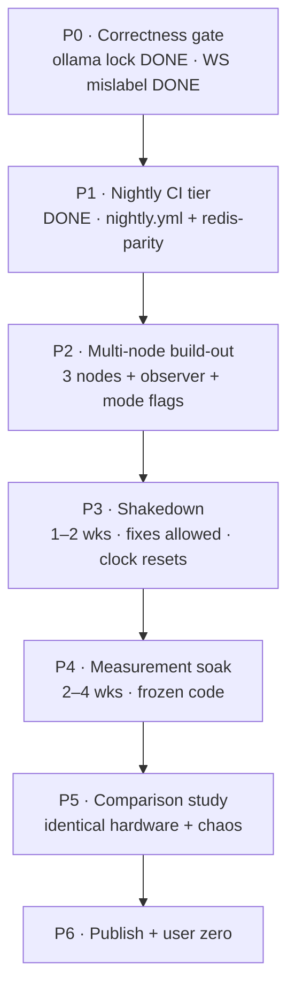

# TESS Engine — Proof Program

Authored 2026-07-29, immediately after W3 (LangGraph checkpointing) landed as PR #16
(head `d5c545b`). **Active program** — this doc is the map from "engineered" to
"proven": the sequence that turns TESS's HA design into published, reproducible
availability data that no other self-hosted gateway is publishing.

Companion to [NEXT_STEPS_PLAN.md](NEXT_STEPS_PLAN.md) (workstream map). That doc
sequences *building*; this doc sequences *proving*. Where they interact, this doc
says so explicitly.

---

## The claim being proven

**TESS is a sovereign-first AI gateway with consensus-backed high availability —
demonstrated, not asserted.** Concretely: a 3-node deployment survives process
kills, full node kills, and datacenter-level faults with measured failover times
and measured availability, under a published chaos schedule, on hardware anyone
can rent, with a harness anyone can re-run.

The comparison target is the gateway-reliability fight (LiteLLM-class), not the
orchestration-quality fight. Orchestration (the graph, spar effect, escalation)
continues as workstreams W4–W6 but is **out of scope for this program's claims**.

### Terminology (used consistently in all published material)

- **Failover** — replacement within the same class (ollama1 → ollama2;
  node-1 → node-2). **Fallback** — a different, degraded path (Ollama → cloud
  provider). This program demonstrates *failover*; fallback is a flag-gated
  product mode, never silently mixed into sovereign numbers.
- **High availability (HA)** — surviving failures (the nines). **High capacity**
  — handling load (throughput). Separate claims, separate charts, never blended.
- **Sovereign-first** — design posture: self-hosted by default. **Sovereign-strict**
  — runtime mode: zero third-party egress, hard-enforced, provable by flag scrape.
  **Availability-first** — runtime mode: cloud fallback permitted, reported
  separately.
- Server-to-server traffic between owned nodes over a private network does **not**
  breach sovereignty. Sovereignty = no data leaves the operator's control to third
  parties. A 3-node private-networked cluster is a *distributed sovereign
  deployment*, not an egress violation.

---

## Sequencing

Phases 0–2 are build work (high-capacity model windows). Phases 3–5 are mostly
calendar time (the servers' time, not the model's). W4/W5/W6 development can
interleave during 3–5 **on branches**, but nothing merges to the deployed ref
during P4 (frozen-code rule).

---

## P0 — Correctness gate  ·  *nothing is measured before this closes*

Two known bugs poison any data collected on top of them.

1. **`app/llm/ollama.py` module-level `asyncio.Lock` — ✅ DONE** (PR #16 C7
   `d5c545b`). Loop-stamped lock; red-first regression
   `test_ollama_lock_survives_event_loop_turnover` locks it permanently. Found
   live by the W3 flag-on smoke — the gate class working as designed.
2. **`OPS_PUBLIC_WS_BASE_URL` mismatch — ✅ DONE** (`7c57ad1` → `864c7ad`, spec:
   [P0_OPENER.md](P0_OPENER.md)). Disconnects are now classified by *change* in
   the server-authored `last_failover_at` between socket open and close
   (opaque-string compare, in-band baseline advance, conservative on every
   unknown — may under-count, never fabricates); the sticky
   `sessions_dropped_last` left the public notice payload. Red-first tests
   distinguish a plain WS disconnect from a real failover in the **user-facing
   signal** (server-side events/metrics were never fabricated — the defect was
   the client-side label); Python mirror + forbidden-token source guard in
   `tests/test_ws_disconnect_classify.py`.

**Also settled here, before any measurement** (decision, ~zero code): does the
900 s `session:{sid}:active_task` stale-TTL window after a hard worker crash
(PR #16 residual gap) count against published availability, or is it scoped out
as "resume availability" pending the W4 supervisor's liveness-checked refusal?
The chaos schedule SIGKILLs workers on repeat, so P3 **will** surface this as
"service up, resume refused" windows. Deciding now is cheap; discovering it in
soak data is a clock reset. Either answer is publishable; an unstated answer is
not.

> **DECIDED (2026-07-29, Jesse):** the window **counts against availability** in
> published numbers until the W4 liveness-checked refusal removes it — scoping it
> out would make the soak data flatter than the product.

**Gate.** Both fixes merged with red-first tests; the 900 s decision recorded in
this doc and in the measurement methodology.

**Size.** ~1 short session.

---

## P1 — Nightly CI tier  ·  ✅ **DONE** (PR #22, spec: [P1_OPENER.md](P1_OPENER.md))

Delivered as `.github/workflows/nightly.yml` (schedule `17 3 * * *` UTC +
`workflow_dispatch`; three legs, every numeric pin probe-measured and cited
inline; deduped `nightly-red` auto-issue on failure) plus the per-push
`redis-parity` job in `ci.yml` (live-Redis checkpointer contract + resume
battery via the binary-factory seam — the PR #16 residual's CI-able piece; the
worker-path interrupt→resume live smoke stays manual, filed P3-adjacent).
Runner-fit resolved by measurement: smoke ~27 min CPU-only, disk a non-issue —
no self-hosted fallback, no Tavily secret. Eval ceilings ride an env-selected
×3 CI wall profile (`GRAPH_EVAL_WALL_PROFILE=ci`); judge identity and set
composition untouched.

**Non-vacuity — five planted violations, each red before its green was trusted**
(full logs pasted in PR #22's body; these lines are the durable record):

1. *splitbrain / product layer* — obs overlay withheld (both sites):
   `[FAIL] s10_failover_visible … scrape http://127.0.0.1:8001/metrics failed: HTTP Error 404`
2. *splitbrain / tally wiring* — pin lowered to 10 while all 11 passed:
   `11/11 PASS` → `EXPECTATION FAILED: 11 scenarios passed, expected 10`
3. *offline / manifest gate* — one byte XOR'd inside the extracted bundle:
   `ERROR: MANIFEST checksum mismatch — bundle corrupt or tampered`
4. *eval / structural layer* — chemistry→biology corrector inversion (app/**
   carve-out pair `b73acad`→`64964a8`):
   `failure: expected agent missing: chemistry (ran: ['biology'])` — judge
   scored the wrong-lens answer 9; the structural layer is what caught it.
5. *redis-parity / vacuity detector* — endpoint withheld:
   `AssertionError: 4 live tests skipped — redis leg is vacuous`

**Dropped to follow-ups (severable by design):** the `s11` single-node variant
— the `10+1 → 11+0` nine-site flip stays filed in
[P1_OPENER.md](P1_OPENER.md) §Follow-ups.

**Size.** Delivered in 1 session (7 nightly runs, 2 measurement + 5
sabotage/verify cycles).

---

## P2 — Multi-node build-out  ·  *the deployment the claim is about*

**Topology.**
- **3 TESS nodes** on Hetzner across **≥2 locations** (e.g., Falkenstein +
  Helsinki) — 3, not 2: the etcd quorum needs 3 members to survive a node loss;
  2 nodes is a split-brain coin flip, which would be a poor look for a product
  whose headline feature is split-brain protection. Covers machine-level *and*
  datacenter-correlation faults.
- **Private inter-node network** (Hetzner vSwitch or WireGuard). All inter-node
  traffic stays inside it — sovereign by construction.
- **ollama1 / ollama2 same-class failover**: LLM serving on ≥2 nodes; an Ollama
  fault fails over to the peer Ollama, keeping the sovereign claim intact. (The
  earlier Ollama→Gemini idea is *fallback* and belongs to availability-first
  mode only.)
- **1 observer node** (tiny instance or external service), **outside the
  cluster**: black-box probes of request success + latency from the user's
  perspective. Internal Prometheus explains *why*; only the external probe can
  honestly say *whether the service was up*. If the probe lived on a cluster
  node, killing that node would kill the evidence.

**Mode flags (product work, small):** `sovereign-strict` vs `availability-first`
as explicit, tested config — strict mode provably blocks third-party egress
(verify in-process, never via container env — the arc's recurring-failure
countermeasure). All published numbers are labeled by mode; the sovereign-strict
chart is the one competitors can't match.

**Traffic generator:** realistic gateway profile — mixed request sizes,
streaming + non-streaming, bursts, injected provider timeouts. Committed to the
repo; it's part of the reproducibility claim.

**Known-interaction note:** WS disconnect/reconnect behavior under node kill
touches the P0 mislabel fix and the W3 resume path — the resume trust model
(client-held `session_id` can steer) is acceptable for a demo cluster but must
be stated in the report's threat-model section before any public live-demo
endpoint exists.

**Gate.** Full stack green on all 3 nodes; split-brain harness passes *against
the real cluster* (not just local compose); observer probe demonstrably survives
any single node's death; strict-mode egress block verified in-process.

**Cost.** ~€40/month for the cluster + observer; rises at P5 (duplicate stack).
Accepted: at this stage running cost may exceed building cost.

**Size.** ~2–3 sessions + provisioning.

---

## P3 — Shakedown  ·  *1–2 weeks · fixes allowed · clock resets on every fix*

Continuous traffic + the chaos schedule (process kills, Ollama kills, full node
SIGKILL/reboot, network partition between locations). **Expectation set in
advance: this phase exists to find weaknesses** — the CP-HA arc's harness found
two product bugs; the W3 smoke found C7; the real cluster will find its own.

Rules:
- Anything found gets fixed (red-first where feasible) and the measurement clock
  **resets**. Mixing fix cycles into the published window either poisons the
  data or publishes teething problems as availability losses.
- Every finding is logged with the provenance discipline — findings become the
  report's "what multi-node revealed that local testing couldn't" section, which
  is what makes the final numbers credible.

**Exit criterion.** N consecutive days (pick N=5–7) of the full chaos schedule
with zero code changes required → P4 may start.

---

## P4 — Measurement soak  ·  *2–4 weeks · frozen code · this is the data*

- Deployed ref frozen (tag it; nightly CI keeps checking it).
- Scheduled chaos continues, including full-node kills and partition drills, on
  a **published schedule** (the schedule ships with the report).
- **Source of truth = the external observer probe.** Collected per mode
  (sovereign-strict / availability-first), separately:
  - Availability (measured, not claimed) against the target set in Decisions.
  - p50/p95/p99 latency, and gateway overhead vs direct provider calls.
  - Failover time distribution under each fault class (does local 2.1 s hold on
    real VPSes under load?).
  - Recovery behavior and any refusal windows (per the P0 decision on the 900 s
    TTL).
- Every number traceable to an artifact; raw data lands in the repo.

**Non-vacuity.** At least one *unscheduled* manual kill during the window,
verified visible in the observer data — proves the pipeline measures reality,
not the schedule.

---

## P5 — Comparison study  ·  *identical hardware, identical chaos*

Stand up LiteLLM (and optionally one more OSS gateway) on an identical Hetzner
footprint, same traffic profile, same chaos schedule, same observer.

**Honest framing, decided in advance:** LiteLLM likely wins raw single-node
throughput and ecosystem breadth — publish that. TESS's aimed-for win is
*behavior under failure*: consensus-backed control plane, fenced writes, no
split-brain, measured failover, offline-capable sovereign packaging. If the
data shows the comparison stack dropping requests or split-braining under the
same kill schedule while TESS doesn't, that is the headline chart. If TESS's
latency overhead is material, publish that too — asymmetric honesty is what
makes the favorable numbers believable.

**Gate.** Methodology written **before** the comparison runs (pre-registration
style); both stacks' configs committed; any tuning applied to one stack is
offered to both.

**Size.** ~1–2 sessions build + the soak window (can overlap P4's tail).

---

## P6 — Publish + user zero

Deliverables, all reproducible:
1. **The benchmark report** — postmortem house style
   (`CP_HA_ENGINEERING_REPORT.md` lineage): methodology, hardware, traffic
   profiles, chaos schedule, raw data, shakedown findings, threat model, limits.
2. **The "kill it live" demo** — recorded (or live) session: dashboard up,
   SIGKILL the leader node, the stream continues.
3. **The chaos harness, runnable by anyone** — "don't trust our numbers, run
   them."
4. **Public Grafana** during/after the soak (read-only).
5. Community posts built from the above (r/selfhosted, HN, LocalLLaMA):
   *"Self-hosted AI gateway with consensus-backed HA — published chaos-test data
   vs LiteLLM."*

**User zero.** Unknown today, by design — the report is the search instrument.
Target populations: sovereignty/data-residency-constrained teams (EU),
self-host/homelab communities, regulated industries. Success = **one** genuine
external deployment giving feedback; that outweighs the next three features.

**Educational pillar note.** The harness + engineering reports + this program
are themselves the educational product ("how to build and prove HA") — a
candidate identity for the unnamed educational `product_mode`.

---

## Relationship to NEXT_STEPS_PLAN workstreams

- **W2 S3** = P1. One item, two docs; this doc defers to W2_OPENER for scope.
- **W4 (seamless migration / cross-provider resume)** — explicitly **after**
  this program's claims. It is the v2 headline ("in-flight runs resume on
  another provider"), and the program must not let benchmark language promise
  it while delivering same-class failover + retry. W3 delivered W4's seam; W4's
  build can start on a branch during P3–P4 calendar time.
- **W5/W6 (escalation, chain quality)** — orchestration-fight work; out of this
  program's claims, free to proceed on branches, frozen out of the deployed ref
  during P4.

---

## Decisions to confirm before P2 (carry into the phase opener)

1. **Availability target** — what number is publicly held? Single-VPS ceiling is
   ~99.9 % regardless of software; the multi-node claim must state its target
   before measurement starts, not after seeing the data.
2. **The 900 s resume-refusal window** — counts against availability, or scoped
   as a stated W4-supervisor limitation? (Settled in P0, restated here because
   it shapes the methodology text.)
3. **Chaos schedule** — fault classes, frequencies, and whether partition drills
   run in P4 or only P3.
4. **Observer implementation** — self-hosted probe on a 4th node vs external
   service (an external service is a third party: fine for *measuring* strict
   mode from outside, but note it in the methodology).
5. **Comparison stack list** — LiteLLM only, or +1 (candidates: Portkey OSS
   gateway); each added stack extends P5 cost and calendar.
6. **Budget ceiling** for the P4+P5 window (cluster ×2 + observer + traffic).

When a phase starts, expand its section into a full opener (arc-context +
invariants + per-step gates + verification), same shape as the workstream
openers.
